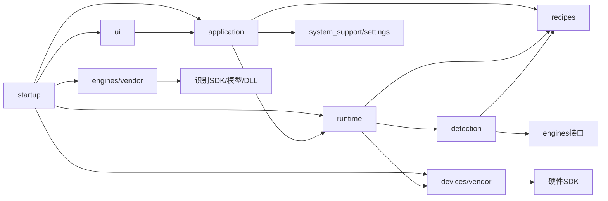
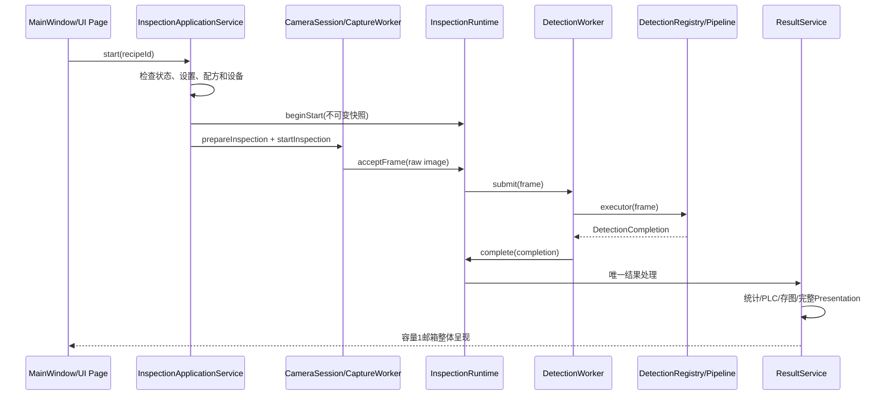

# OCRGangYin 开发者代码结构与维护指南

版本：1.3
编制日期：2026-08-18
代码基线：`b22ff8d`之后的S8 Runtime/Recipes认知精简工作树
适用工程：`app/AutoOCRproject.pro`，Qt 5.14、qmake、MSVC2017、C++11

## 一、文档范围和阅读方式

本文面向第一次接手OCRGangYin代码的开发者。第二章只统计并展示`app/`当前全部157个C++代码文件：83个`.h`和74个`.cpp`；后续章节逐个解释这些代码文件。`AutoOCRproject.pro`、`main_window.ui`、`image.qrc`、两份翻译源文件以及Release部署脚本作为工程辅助文件单独说明，但不计入代码文件数。图片、图标、CSS、`.qm`、模型和DLL属于资源或部署资产，不纳入代码文件树。

S8已于2026-08-18通过用户Qt Creator统一门禁，本文件描述的是已验证的S8最终代码。S8只合并了无独立策略的包装层：`runtime`现有21个代码文件，`recipes`现有8个代码文件；算法、资源、Schema、统计和正常PLC时序没有改变。

建议按任务选择阅读深度：

1. 只想知道程序如何运行：先读第二、三、四章。
2. 需要修改某项功能：先看第十二章的“按任务找文件”，再回查第六至十一章对应文件。
3. 需要新增检测模式：重点读`contracts/detection_mode.*`、`detection/detection_registry.*`、配方模型和第十三章。
4. 遇到线程、结果错位或PLC问题：重点读Runtime文件表和第十四、十五章。
5. 准备提交：直接执行第二十章的静态检查与用户门禁清单。

## 二、架构结论

OCRGangYin是“模块化单体”，不是插件系统，也不是微服务。程序只有一个进程、一个主窗口和一条正式生产链。目录数量较多，是为了隔离UI、用例、线程、算法和供应商SDK；真正需要从头读到尾的主路径只有一条：

```text
startup/main.cpp
→ ApplicationStartup
→ MainWindow
→ InspectionApplicationService
→ CameraSession
→ CaptureWorker
→ FrameQueue
→ DetectionWorker
→ DetectionRegistry
→ 当前Detection Pipeline
→ ResultService
→ PLC / ImageSaveService / ResultPresentationMailbox
→ UI
```

五种模式不在Runtime中分别实现。它们只在`DetectionModeDescriptor`登记稳定元数据，由`DetectionRegistry`装配各自Pipeline。Runtime只回答“何时采集、何时检测、怎样结算、怎样停止和怎样进入Fault”，不回答“当前是钢印还是二维码算法”。

### 2.1 当前目录树

```text
app/
├─ AutoOCRproject.pro             qmake唯一主工程
├─ startup/                       进程入口、启动保护和对象组合根
├─ contracts/                     跨层稳定枚举、ID和默认值
├─ application/                   用户用例、启动预检、结构化DTO
├─ recipes/                       配方Schema、准备、事务存储和编辑会话
├─ detection/                     预处理、定位、五种算法和唯一装配边界
├─ runtime/                       相机会话、线程、队列、运行状态、结果、PLC和存图
├─ devices/                       物理相机/PLC端口及供应商实现
├─ engines/                       OCR/二维码识别引擎端口及供应商实现
├─ system_support/                设置、日志、授权、崩溃和部署
├─ ui/                            主窗口、页面、对话框、Presenter和自定义控件
└─ image/                         Qt资源清单及静态视觉资源
```

### 2.2 当前完整代码文件树

下面只展示`app/`当前全部157个C++代码文件，即83个`.h`和74个`.cpp`。工程配置、UI表单、资源清单、翻译、部署脚本、CSS、图标和图片均不计入代码文件数量，也不在这棵树中展示。

```text
app/
├─ application/
│  ├─ application_result.h
│  ├─ camera_application_contract.h
│  ├─ inspection_application_service.cpp
│  ├─ inspection_application_service.h
│  ├─ inspection_start_preflight.cpp
│  ├─ inspection_start_preflight.h
│  ├─ inspection_ui_contract.h
│  ├─ runtime_snapshot.h
│  ├─ settings_application_service.cpp
│  ├─ settings_application_service.h
│  ├─ template_application_service.cpp
│  ├─ template_application_service.h
│  ├─ template_editor_contract.h
│  ├─ template_geometry_service.cpp
│  └─ template_geometry_service.h
├─ contracts/
│  ├─ barcode_parameter_defaults.h
│  ├─ detection_mode.cpp
│  └─ detection_mode.h
├─ detection/
│  ├─ detection_profile_snapshot.cpp
│  ├─ detection_profile_snapshot.h
│  ├─ detection_registry.cpp
│  ├─ detection_registry.h
│  ├─ barcode_word/
│  │  ├─ barcode_word_detection_pipeline.cpp
│  │  └─ barcode_word_detection_pipeline.h
│  ├─ common/
│  │  ├─ character_template_matcher.cpp
│  │  ├─ character_template_matcher.h
│  │  ├─ detection_roi_geometry.h
│  │  ├─ frame_preprocessor.cpp
│  │  ├─ frame_preprocessor.h
│  │  ├─ profile_pose_selector.cpp
│  │  └─ profile_pose_selector.h
│  ├─ ocr/
│  │  ├─ ocr_detection_pipeline.cpp
│  │  └─ ocr_detection_pipeline.h
│  ├─ positioning/
│  │  ├─ detection_pose.h
│  │  ├─ inspection_positioner.cpp
│  │  ├─ inspection_positioner.h
│  │  ├─ tracking_pose_matcher.cpp
│  │  └─ tracking_pose_matcher.h
│  ├─ stamp/
│  │  ├─ overlap_detector.cpp
│  │  ├─ overlap_detector.h
│  │  ├─ stamp_detection_pipeline.cpp
│  │  └─ stamp_detection_pipeline.h
│  ├─ tissue/
│  │  ├─ tissue_detection_pipeline.cpp
│  │  ├─ tissue_detection_pipeline.h
│  │  ├─ tissue_roll_detector.cpp
│  │  └─ tissue_roll_detector.h
│  └─ word/
│     ├─ word_detection_pipeline.cpp
│     └─ word_detection_pipeline.h
├─ devices/
│  ├─ camera/
│  │  ├─ camera_device.h
│  │  └─ vendor/
│  │     ├─ hikvision_camera_device.cpp
│  │     └─ hikvision_camera_device.h
│  └─ plc/
│     ├─ plc_device.h
│     └─ vendor/
│        ├─ snap7_plc_device.cpp
│        ├─ snap7_plc_device.h
│        ├─ snap7.cpp
│        └─ snap7.h
├─ engines/
│  ├─ barcode/
│  │  ├─ barcode_decoder.h
│  │  ├─ barcode_types.h
│  │  └─ vendor/
│  │     ├─ barcode_decoder_adapter.cpp
│  │     ├─ barcode_decoder_adapter.h
│  │     └─ barcode_decoder_api.h
│  └─ ocr/
│     ├─ ocr_engine.h
│     └─ vendor/
│        ├─ paddle_ocr_engine.cpp
│        ├─ paddle_ocr_engine.h
│        └─ paddle/
│           ├─ include/
│           │  ├─ clipper.h
│           │  ├─ config.h
│           │  ├─ ocr_cls.h
│           │  ├─ ocr_det.h
│           │  ├─ ocr_rec.h
│           │  ├─ postprocess_op.h
│           │  ├─ preprocess_op.h
│           │  └─ utility.h
│           └─ src/
│              ├─ clipper.cpp
│              ├─ config.cpp
│              ├─ ocr_cls.cpp
│              ├─ ocr_det.cpp
│              ├─ ocr_rec.cpp
│              ├─ postprocess_op.cpp
│              ├─ preprocess_op.cpp
│              └─ utility.cpp
├─ recipes/
│  ├─ prepared_recipe.cpp
│  ├─ prepared_recipe.h
│  ├─ product_recipe.cpp
│  ├─ product_recipe.h
│  ├─ recipe_editor_session.cpp
│  ├─ recipe_editor_session.h
│  ├─ recipe_store.cpp
│  └─ recipe_store.h
├─ runtime/
│  ├─ camera_session.cpp
│  ├─ camera_session.h
│  ├─ capture_worker.cpp
│  ├─ capture_worker.h
│  ├─ detection_worker.cpp
│  ├─ detection_worker.h
│  ├─ frame_queue.cpp
│  ├─ frame_queue.h
│  ├─ image_save_service.cpp
│  ├─ image_save_service.h
│  ├─ inspection_plc_controller.cpp
│  ├─ inspection_plc_controller.h
│  ├─ inspection_presentation_renderer.cpp
│  ├─ inspection_presentation_renderer.h
│  ├─ inspection_presentation.h
│  ├─ inspection_runtime.cpp
│  ├─ inspection_runtime.h
│  ├─ result_presentation_mailbox.cpp
│  ├─ result_presentation_mailbox.h
│  ├─ result_service.cpp
│  └─ result_service.h
├─ startup/
│  ├─ application_startup.cpp
│  ├─ application_startup.h
│  ├─ main.cpp
│  ├─ runtime_guard.cpp
│  ├─ runtime_guard.h
│  ├─ single_instance_guard.cpp
│  └─ single_instance_guard.h
├─ system_support/
│  ├─ machine_settings_policy.cpp
│  ├─ machine_settings_policy.h
│  ├─ crash/
│  │  ├─ windows_crash_handler.cpp
│  │  ├─ windows_crash_handler.h
│  │  ├─ windows_crash_stack.cpp
│  │  └─ windows_crash_stack.h
│  ├─ license/
│  │  ├─ license_codec.cpp
│  │  └─ license_codec.h
│  ├─ logging/
│  │  ├─ application_logger.cpp
│  │  └─ application_logger.h
│  └─ settings/
│     ├─ machine_settings_store.cpp
│     ├─ machine_settings_store.h
│     ├─ machine_settings.cpp
│     └─ machine_settings.h
└─ ui/
   ├─ main_window_inspection.cpp
   ├─ main_window_settings.cpp
   ├─ main_window.cpp
   ├─ main_window.h
   ├─ controllers/
   │  ├─ operation_ui_policy.cpp
   │  ├─ operation_ui_policy.h
   │  ├─ settings_edit_state.cpp
   │  └─ settings_edit_state.h
   ├─ dialogs/
   │  ├─ character_template_editor_dialog.cpp
   │  ├─ character_template_editor_dialog.h
   │  ├─ recipe_selection_dialog.cpp
   │  └─ recipe_selection_dialog.h
   ├─ pages/
   │  ├─ inspection_page.cpp
   │  ├─ inspection_page.h
   │  ├─ machine_settings_page.cpp
   │  ├─ machine_settings_page.h
   │  ├─ template_editor_page.cpp
   │  ├─ template_editor_page.h
   │  ├─ template_editor_profile_commands.cpp
   │  ├─ template_editor_recipe.cpp
   │  ├─ template_editor_support.cpp
   │  ├─ template_editor_support.h
   │  └─ template_editor_view.cpp
   ├─ presenters/
   │  ├─ inspection_fault_presenter.cpp
   │  └─ inspection_fault_presenter.h
   └─ widgets/
      ├─ image_label.cpp
      └─ image_label.h
```

文件树阅读规则：

- 上述157个`.h/.cpp`的逐文件职责和维护边界见第六至十一章。
- `AutoOCRproject.pro`、`main_window.ui`、`image.qrc`、`.ts`和部署脚本仍在第六章“工程入口与外部资产”中说明，但不计入代码文件数。
- `image/`中的CSS、PNG、ICO和`.qm`属于原样保留的视觉/翻译资源，不纳入代码文件树；此次精简不删除、不合并资源文件。
- 新增、删除或移动代码文件时，必须同时更新`AutoOCRproject.pro`、本代码文件树以及对应的逐文件说明。


### 2.3 代码规模

| 模块 | `.h/.cpp`数量 | 说明 |
|---|---:|---|
| `startup` | 7 | 入口和对象组装 |
| `contracts` | 3 | 稳定跨层合同 |
| `application` | 15 | 用户用例和DTO |
| `recipes` | 8 | 4组明确职责 |
| `detection` | 30 | 五模式算法、公共预处理和装配 |
| `runtime` | 21 | 10组运行职责加1个呈现数据头 |
| `devices` | 8 | 相机、PLC端口和vendor实现 |
| `engines` | 24 | OCR、二维码端口和vendor源码 |
| `system_support` | 14 | 设置与系统保障；另有1个部署脚本 |
| `ui` | 27 | 主窗口、页面、对话框和控件；另有1个`.ui` |
| 合计 | 157 | 不含`.pro/.ui/.qrc/.ts/.ps1` |

## 三、强制依赖方向



维护时必须遵守：

- `startup`可以构造所有具体实现，但不能包含业务规则。
- `ui`只能调用Application服务、消费DTO和显示结果；不得拥有设备、生产线程、算法、PLC时序或存图服务。
- `application`组织用例和错误映射，不实现图像算法或供应商SDK调用。
- `runtime`不依赖`QWidget`、`Ui::MainWindow`或`QMessageBox`，也不维护五种具体模式分支。
- `detection`不访问UI、磁盘、PLC和相机SDK。
- `recipes`不依赖Detection实现、UI或全局设置管理器。
- 供应商类型只允许出现在`devices/*/vendor`或`engines/*/vendor`。

## 四、五条核心调用链

### 4.1 应用启动

```text
main
→ ApplicationStartup::run
→ QApplication / 翻译 / 样式
→ 单实例、授权、日志、崩溃处理
→ 构造Camera/PLC/OCR/Barcode具体实现
→ 构造Store、Registry、Runtime、ApplicationService
→ 构造MainWindow和三个Page
→ 注入依赖并显示主窗口
```

`ApplicationStartup`是具体实现唯一组合点。若更换海康相机、Snap7、PaddleOCR或Barcode DLL实现，应优先只改这里的构造和对应vendor适配器。

### 4.2 正式检测



关键不变量：一个`ProductKey`只允许一次最终结算；图、Overlay、文字、模板名、判定、统计和耗时必须属于同一个产品。

### 4.3 模板和配方

```text
TemplateEditorPage
→ TemplateApplicationService
→ RecipeEditorSession（编辑工作区与资源暂存）
→ RecipeStore::saveRecipe（临时目录写入和重载校验）
→ 正式目录备份/替换/失败回滚
→ RecipeStore::loadPreparedRecipe
→ PreparedRecipeSnapshot
```

`ProductRecipe`是可序列化Schema；`PreparedRecipe`是资源已加载、可供运行读取的快照。不要让运行线程直接读取`recipe.json`或模板目录。

### 4.4 设置

```text
MachineSettingsPage
→ SettingsApplicationService::updateDraft
→ MachineSettingsStore::save
→ m_appliedMachineSettings
→ 下一次InspectionApplicationService::start冻结快照
```

运行中参数编辑由UI禁用，Application/Runtime仍必须保留第二层拒绝。整机设置与产品配方不可混用：曝光、增益、PLC、触发和存图属于`MachineSettings`；目标文字、ROI、阈值和模板资源属于`ProductRecipe/Profile`。

### 4.5 Fault与停止

```text
相机错误 / PLC写失败 / 硬触发队列满 / 检测基础设施错误
→ InspectionRuntime::enterFault（记录首因并停止新受理）
→ CaptureWorker停止 + FrameQueue取消 + DetectionWorker join
→ 已完成算法结论保留
→ 未完成产品记Unconfirmed
→ UI显示“视觉检测暂停、输送线状态未知”
→ 操作员确认且线程已退出后回到Idle
```

Fault不是产品NG。禁止为未完成产品猜测补发49。正常PLC合同保持OK写0，NG写49、约100ms后写0。

## 五、核心数据和所有权

| 类型 | 创建位置 | 生命周期/所有权 | 禁止做法 |
|---|---|---|---|
| `MachineSettings` | Store加载、UI草稿、启动时复制 | 值对象；一次运行读取冻结副本 | 运行中重新读取控件或JSON |
| `ProductRecipe` | 新建/加载/编辑会话 | 可编辑值对象；发布后由`shared_ptr<const>`持有 | 保存绝对资源路径 |
| `PreparedRecipe` | `prepareRecipe` | `PreparedRecipeSnapshot`只读共享 | Pipeline运行时临时读盘 |
| `InspectionRunContext` | `InspectionRuntime::beginStart` | 只在`inspection_runtime.cpp`内定义；一次运行唯一 | 暴露成跨层可写公共对象 |
| `FrameData` | Runtime受理相机原帧 | `shared_ptr<const>`；创建时克隆图像 | 引用相机回调临时缓冲区 |
| `DetectionResult` | Detection Pipeline | 不持有原图；只保存判定、文本、Overlay和策略 | 直接统计、写PLC或存图 |
| `DetectionCompletion` | Detection执行器 | 短期携带同一帧与结果到ResultService | 作为无界历史队列 |
| `InspectionPresentation` | ResultService | 容量1邮箱交给UI整体消费 | 多个Qt信号分散更新同一产品 |

## 六、工程、启动、合同、应用和配方文件

### 6.1 工程与声明文件

| 文件 | 详细职责 | 维护要点 |
|---|---|---|
| `app/AutoOCRproject.pro` | 主程序唯一qmake工程；登记全部源码、头、`main_window.ui`、`image.qrc`和翻译源，配置Qt Widgets、C++11、MSVC `/utf-8`、Paddle/OpenCV/MVS/Snap7链接以及Release部署后处理。 | 新增、删除或移动编译文件必须同步修改；不得重复库项、部署段或旧路径。Agent不运行qmake，最终由用户在Qt Creator执行Run qmake和Rebuild。 |
| `app/ui/main_window.ui` | Qt Designer主界面真源，定义左右面板、六个主操作按钮、结果区、模板/图像/PLC/软件设置页和自定义`ImageLabel`。页面类通过显式ViewBindings引用这里的控件。 | 不手改生成的`ui_main_window.h`；重命名控件必须同步自动槽和所有ViewBindings。模式下拉项来自Descriptor，不要重新硬编码五个条目。 |
| `app/image/image.qrc` | Qt资源唯一清单，注册图标、图片、主题CSS和编译后的翻译资源。 | 本轮资源冻结；新增/改名资源时检查路径大小写和部署结果，业务代码不能绕开qrc复制第二份内置资源。 |
| `app/Translate_CN.ts` | 中文Qt翻译源，约150条消息；运行时加载对应`.qm`。 | 源码中文已直接使用UTF-8；修改可翻译文本后由Qt翻译流程更新，不能手改`.qm`替代`.ts`。 |
| `app/Translate_EN.ts` | 英文Qt翻译源，与中文源保持同一消息集合。 | 保持context/source键一致；`unfinished`项需要真实英文确认，不能随意机器翻译业务/故障术语。 |

### 6.2 `startup/`

| 文件 | 详细职责 | 维护要点 |
|---|---|---|
| `app/startup/main.cpp` | 最小进程入口，只把`argc/argv`交给`ApplicationStartup::run`。 | 不在这里添加设备、业务、样式或窗口逻辑。 |
| `app/startup/application_startup.h` | 声明组合根`ApplicationStartup`及静态`run`入口。 | 保持头文件轻量，不向外暴露具体vendor类型。 |
| `app/startup/application_startup.cpp` | 初始化QApplication、翻译、样式、单实例、授权、日志和崩溃处理；构造相机/PLC/OCR/二维码具体实现、Store、DetectionRegistry、Runtime、应用服务、三个页面和MainWindow；连接顶层生命周期并负责退出清理。 | 允许“构造和连接”，不允许判定、PLC时序或算法分支。新增必选依赖应在这里一次注入，不能在业务对象内部偷偷创建全局单例。 |
| `app/startup/runtime_guard.h` | 声明启动授权检查入口。 | 只返回是否允许继续启动，不显示业务页面。 |
| `app/startup/runtime_guard.cpp` | 从应用目录读取`license.ini`，调用`LicenseCodec`并核对当前日期。 | 授权格式由`LicenseCodec`唯一维护；提示与退出策略由启动层决定。 |
| `app/startup/single_instance_guard.h` | 声明基于`QSharedMemory`的单实例守卫并持有共享内存生命周期。 | 共享键变化会影响现有部署，只能有一个稳定来源。 |
| `app/startup/single_instance_guard.cpp` | 使用固定键`ecust`创建共享内存；创建失败表示已有实例。 | 不把业务状态写入该共享内存，也不要用进程扫描替代稳定守卫。 |

### 6.3 `contracts/`

| 文件 | 详细职责 | 维护要点 |
|---|---|---|
| `app/contracts/barcode_parameter_defaults.h` | 二维码格式掩码、ROI外扩比例、最大解码时间和fallback开关的唯一默认值。 | Schema、配方默认值和解码器不得各自复制数字；调整默认值属于行为变化，需要样本回归。 |
| `app/contracts/detection_mode.h` | 定义五种稳定`DetectionMode`、定位类型`DetectionTrackingKind`和唯一`DetectionModeDescriptor`合同，以及Recipe ID/UI ID转换接口。 | 跨层只能依赖这里的轻量类型；不要把Pipeline类、UI控件或运行对象放进合同层。 |
| `app/contracts/detection_mode.cpp` | 唯一登记五种模式的Recipe ID、UI ID、中文名、Worker日志名、启动错误、定位要求、资源要求、呈现/存图策略和耗时精度。 | 新增模式必须先在此形成一条完整Descriptor；不得在Settings、UI、Runtime再维护第二套模式顺序或分类。 |

### 6.4 `application/`

| 文件 | 详细职责 | 维护要点 |
|---|---|---|
| `app/application/application_result.h` | 定义通用`ApplicationError`和`OperationResult`，把用户提示、诊断和成功/拒绝状态结构化。 | Application返回结果，不弹`QMessageBox`；错误码应稳定、可定位。 |
| `app/application/camera_application_contract.h` | 定义软/硬触发、相机打开、参数范围和恢复结果的UI DTO，隔离Runtime/Device内部枚举。 | UI只消费DTO；设备原生错误码可作为诊断保留，但不能泄露SDK对象。 |
| `app/application/runtime_snapshot.h` | 定义UI可读取的`ApplicationRuntimeState`和`RuntimeSnapshot`，包含状态、相机/PLC/采集和Fault摘要。 | 它是只读观察，不是第二套运行状态机；状态源只能是InspectionRuntime。 |
| `app/application/inspection_ui_contract.h` | 定义结果视图绑定、判定样式、UI回调和`ApplicationFaultSnapshot`。 | 只允许普通Qt值和回调；不得放入设备或Worker所有权。 |
| `app/application/inspection_start_preflight.h` | 定义启动拒绝原因、访问条件、Profile/资源输入和`InspectionStartPreflightResult`。 | 新增启动条件应成为明确Issue，不要在UI和Runtime各写一份布尔判断。 |
| `app/application/inspection_start_preflight.cpp` | 实现启动访问顺序和资源门禁：忙碌、相机、设置dirty、PLC、配方、目标字符、模板、Profile、条码引擎等。 | 拒绝顺序会影响用户看到的第一条提示，调整时必须做五模式失败路径回归。 |
| `app/application/inspection_application_service.h` | 声明正式检测应用边界：启动/停止、相机、PLC、模板预览、统计清零、Fault确认、快照和UI绑定；同时定义结构化命令/结果DTO。 | 这是UI唯一运行用例入口；不要新增“为了方便”直接返回Runtime或Device对象的接口。 |
| `app/application/inspection_application_service.cpp` | 编排完整启动事务、不可变运行快照、相机准备/恢复、软硬触发、停止、Fault、相机参数、PLC命令、模板预览和UI发布；把Runtime/Camera结果映射为Application DTO和中文提示。 | 文件较大但职责是单一用例边界。扩展时优先提取纯映射/预检，不把五模式算法或设备SDK塞入此文件。启动失败必须回滚Runtime并恢复相机。 |
| `app/application/settings_application_service.h` | 声明机器设置的当前值、草稿、可编辑草稿、应用、放弃、默认、清空和路径查询。 | UI不得直接调用MachineSettingsStore。 |
| `app/application/settings_application_service.cpp` | 在内存中维护已应用值与草稿，调用Store执行事务保存，统一转换保存失败为`OperationResult`。 | `current`和`draft`的区别必须保留；运行参数只使用已应用值。 |
| `app/application/template_editor_contract.h` | 定义模板编辑跨UI/Application DTO：条码验证选项、字库Profile、配方目录项和损坏项。 | 保持为数据合同，不放对话框、文件写入或算法所有权。 |
| `app/application/template_geometry_service.h` | 定义显示几何和Profile几何结构，声明显示坐标到原图坐标以及跟踪/二维码/日期ROI转换。 | 所有模板坐标换算统一从这里走，避免不同页面重复缩放公式。 |
| `app/application/template_geometry_service.cpp` | 实现letterbox偏移、比例、裁边和多种ROI坐标映射。 | 修改缩放/取整规则会影响已保存ROI，必须用靠四边和不同宽高比图像回归。 |
| `app/application/template_application_service.h` | 声明模板完整用例：新建/编辑/取消/发布、目录枚举、PreparedRecipe加载、工作区资源暂存、几何、即时条码验证、模式配方记忆和字库Profile状态。 | UI只经此服务访问RecipeStore和编辑会话；S8后模式记忆直接保存为QMap，不再引入一层包装类。 |
| `app/application/template_application_service.cpp` | 委托`RecipeEditorSession`管理草稿和资源，委托Store事务发布，调用GeometryService和Barcode接口完成校验，并维护已激活配方、各模式最近配方及字库编辑状态。 | 保持应用编排职责；不能把字符匹配或正式检测算法移入此处。条码即时验证失败只影响模板操作，不形成生产结果。 |

### 6.5 `recipes/`

| 文件 | 详细职责 | 维护要点 |
|---|---|---|
| `app/recipes/product_recipe.h` | 正式配方Schema：纸巾参数、二维码参数、字符框、Profile、产品UUID/名称/模式/资产Map；声明创建、校验、JSON转换和只读快照。 | Schema版本、字段归属和默认值必须与数据Schema文档一致；资源只能使用相对路径和稳定资产键。 |
| `app/recipes/product_recipe.cpp` | 实现五模式配方校验、UUID/名称/Profile/ROI/参数范围/资产角色验证，以及JSON序列化和反序列化。 | 不在此加载图片或执行算法；新增字段必须同时实现写出、读入、默认、范围和交叉约束。 |
| `app/recipes/prepared_recipe.h` | 定义资源已加载后的`PreparedRecipe/Profile/CharacterAsset`只读运行模型和准备接口。 | 运行所需图片、YAML和字符索引应在启动前一次准备，Pipeline不得补读磁盘。 |
| `app/recipes/prepared_recipe.cpp` | 安全解析资产路径，加载原图、定位模板、钢印环、校准多边形和字符模板，匹配目标字符索引，形成`PreparedRecipeSnapshot`。 | 路径必须留在配方目录内；任何资源缺失/损坏应拒绝准备，不得静默跳过或换算法。 |
| `app/recipes/recipe_store.h` | 声明已发布配方目录的加载、Prepared加载、枚举和整目录事务保存；允许注入目录rename函数验证失败回滚。 | Store是正式配方目录唯一写入口。 |
| `app/recipes/recipe_store.cpp` | 将`recipe.json`和资产写入同级临时目录，重新加载并比较，旧正式目录先改名备份，再提交临时目录；提交失败恢复备份。也负责枚举损坏配方。 | 不能退化为逐文件覆盖；临时/备份目录清理必须限定在recipes根内。保存成功前旧配方必须一直可读。 |
| `app/recipes/recipe_editor_session.h` | 定义编辑会话状态、首次Profile资源输入和编辑工作区API；S8后同时承担模板图、校准文件和字符图的暂存。 | 会话工作区不是正式配方目录；公开方法不得允许更改会话中的recipeId或检测模式。 |
| `app/recipes/recipe_editor_session.cpp` | 创建/清理UUID工作区，载入已有配方为草稿，替换草稿和Profile，暂存PNG/BMP/YAML/字符PNG，最后委托Store发布并刷新资产来源。 | 文件名、资产键和相对目录是配方合同；失败时保留草稿供用户修正，析构只删除经过路径核对的本会话目录。 |

## 七、Runtime逐文件说明

Runtime只管理运行生命周期和副作用，不实现五种具体算法。主阅读顺序是`camera_session`→`capture_worker`→`frame_queue`→`detection_worker`→`inspection_runtime`→`result_service`。其余文件是这条链上的PLC、存图和呈现能力。

| 文件 | 详细职责 | 维护要点 |
|---|---|---|
| `app/runtime/camera_session.h` | 定义相机打开/参数/恢复DTO、采集配置、回调和`CameraSession`接口；Session统一承接正式软硬触发与模板预览。 | 只依赖`ICameraDevice`，不能出现海康SDK类型。正式配置使用`hardwareTriggerEnabled`，不要重新引入RunPlan包装或五模式字段。 |
| `app/runtime/camera_session.cpp` | 执行首台相机打开、曝光/增益范围与下发、正式相机准备、软硬触发模式切换、硬触发延时、预览、停止恢复和原帧提交；预览帧在这里显示预处理，正式帧原样进入Runtime。 | 相机准备是有顺序的设备事务；不要随意改变stop/startGrabbing和100/200ms设备稳定等待。正式旋转、通道和定位必须留在DetectionWorker侧。 |
| `app/runtime/capture_worker.h` | 定义`Preview/SoftwareTrigger/HardwareTrigger`三种采集模式、帧/错误/停止回调和单一采集Worker。 | Worker只有一个`std::thread`；接口必须支持协作停止和可重复启动。 |
| `app/runtime/capture_worker.cpp` | 软件模式按需触发并等待新帧，硬件/预览模式等待相机帧；连续超时达到既有门禁后报告错误；`stop`调用`interruptWait`并join。 | 禁止detach、强杀或超时后放弃对象。软触发不能读取硬触发延时或增加固定节拍休眠。 |
| `app/runtime/frame_queue.h` | 定义容量明确的正式帧队列、阻塞提交、非阻塞提交、等待取出、取消和重新打开。 | 正式检测容量当前为1；改变容量会改变硬触发溢出和整体反压语义，不能当普通性能优化。 |
| `app/runtime/frame_queue.cpp` | 使用mutex和condition_variable实现有界FIFO；`cancel`同时唤醒生产者和消费者。 | 所有等待谓词都必须包含取消条件；重启前调用`reopen`，停止时不能遗漏唤醒。 |
| `app/runtime/detection_worker.h` | 定义提交结果枚举和串行`DetectionWorker`；Worker消费FrameQueue并调用注入的DetectionExecutor。 | 只接受通用执行器，不识别五种模式。队列容量、处理/取消计数和Failure回调是运行诊断边界。 |
| `app/runtime/detection_worker.cpp` | 管理检测线程启动、submit/trySubmit、停止请求、join和执行循环；把异常转换成基础设施失败，正常Completion交给唯一消费者。 | 不能在这里统计、写PLC、存图或更新UI；异常不能伪装为产品NG。 |
| `app/runtime/inspection_runtime.h` | 定义`Idle/Starting/Running/Stopping/Fault`唯一状态机、Fault原因/快照和`InspectionRuntime`公开接口；拥有DetectionWorker、产品账本、Registry、ResultService、PLC控制器和UI邮箱。 | 这是运行状态唯一真源。不要新增UI状态副本或按模式分支；公开接口变化需检查Application所有调用。 |
| `app/runtime/inspection_runtime.cpp` | 在实现文件内定义一次运行唯一的不可变`InspectionRunContext`；实现启动提交/回滚、停止、Fault、产品受理/完成/claim、Worker创建停止、UI邮箱、统计查询和PLC委托。 | 产品账本保证每个ProductKey只完成一次；停止顺序必须先禁止新受理、再取消等待、最后join。RunContext不要重新公开成可写模块。 |
| `app/runtime/result_service.h` | 定义结果保存动作、PLC动作、运行保存配置、回调、处理结果和`ResultService`；声明统计、异常统计、延迟NG、存图和完整呈现接口。 | 所有产品结果副作用必须从这里唯一产生；不要在UI、Pipeline或CameraSession增加旁路。 |
| `app/runtime/result_service.cpp` | 接收唯一Completion，判定是否统计/存图/PLC，维护OK/NG与异常计数，管理延迟NG队列和约100ms复位，提交ImageSaveTask，生成并经容量1邮箱发布Presentation；PLC失败进入Fault。 | 同一ProductKey只能调用一次正式process。正常OK=0、NG=49→约100ms→0不可改变；Fault不得覆盖已有算法结论或猜测补发NG。 |
| `app/runtime/inspection_presentation.h` | 定义UI完整结果快照：判定样式、正常/异常统计、图像、Overlay、文字、模板名、耗时和错误状态。 | 新增显示字段应进入同一个Presentation，不要另发独立排队信号。 |
| `app/runtime/inspection_presentation_renderer.h` | 定义纯呈现状态、显式ViewBindings和Renderer接口。 | Renderer可操作注入的显示回调，但不能拥有业务Page或`Ui::MainWindow`。 |
| `app/runtime/inspection_presentation_renderer.cpp` | 把Overlay画到结果图，格式化判定、文字、模板、统计、合格率和耗时，并一次应用到绑定视图；也支持预览帧和清理。 | 渲染只改变显示，不得改变DetectionResult或统计；颜色、文字和小数位调整属于UI回归范围。 |
| `app/runtime/result_presentation_mailbox.h` | 定义容量固定为1的`UiCompletionMailbox`，保存一项待UI线程执行的完整工作。 | 文件名保留历史但类型名表达实际用途；容量1是正式背压合同，不应改成无界Qt事件积压。 |
| `app/runtime/result_presentation_mailbox.cpp` | 用条件变量实现submit等待空位、UI侧processOne取出执行、cancel唤醒。 | UI执行完成前槽位仍被占用；停止/Fault必须取消等待，避免生产线程卡死。 |
| `app/runtime/image_save_service.h` | 定义单张保存项、单产品任务、提交结果和有界`ImageSaveService`；容量32、Worker数2由服务合同固定。 | 一个产品只提交一个任务；任务内决定原图/标注图组合，不能为每张图片创建无界线程。 |
| `app/runtime/image_save_service.cpp` | 两个后台线程消费容量32队列，JPEG质量取任务配置，队满时提交侧等待，关闭时协作排空/退出并汇总写入错误。 | 正常命中保存策略的任务不能因队满丢失；只有真实写盘失败允许缺图，且不能修改产品判定。 |
| `app/runtime/inspection_plc_controller.h` | 定义PLC工艺字段、运行设置、地址Map和类型化控制器接口。 | 固定DB/Offset和Word/DWord编码集中维护；UI/Application不得自行拼字节。 |
| `app/runtime/inspection_plc_controller.cpp` | 委托`IPlcDevice`连接/断开和写入，按稳定顺序下发触发模式、拍照距离/时间、剔除距离/时间/位置及结果值，并执行大端编码。 | 写入顺序、地址、宽度和字节序属于现场合同；修改必须有真实PLC验证，Fake不能冒充机械动作成功。 |

## 八、Detection逐文件说明

Detection是算法唯一所有者。公共步骤先处理原帧、定位和ROI，再进入五种Pipeline；Pipeline只产生`DetectionResult`，不直接碰UI、磁盘或PLC。

### 8.1 通用合同、装配和预处理

| 文件 | 详细职责 | 维护要点 |
|---|---|---|
| `app/detection/positioning/detection_pose.h` | Detection核心数据头：`ProductKey`、`FrameData`、判定/状态、Overlay、`DetectionResult`、`DetectionCompletion`、Pose、WorkItem、Profile和旋转ROI；还提供帧克隆和坐标旋转内联函数。 | 这是跨Runtime/Detection的高影响合同。`FrameData`创建时必须clone原图；`DetectionResult`不得持有原图或执行副作用。新增字段需同步ResultService和Renderer。 |
| `app/detection/detection_registry.h` | 定义运行准备结果、Registry请求、通用`DetectionExecutor`和创建结果；`DetectionRegistry`持有OCR/Barcode接口并提供`prepare/create`。 | Runtime只看此通用边界；新增模式不应让Runtime include新Pipeline。 |
| `app/detection/detection_registry.cpp` | Detection唯一装配点：冻结Descriptor策略，创建Positioner，执行正式预处理，按模式构造五种Pipeline和捕获的只读资源；将Pipeline输出统一映射成Completion。 | 模式分支只允许集中在这里和各Pipeline；不能在Runtime/UI复制。Executor捕获资源必须保证运行期只读和生命周期安全。 |
| `app/detection/detection_profile_snapshot.h` | 定义多Profile运行条目、同序定位/检测快照和Builder。每个条目包含目标、模板名、字符模板、索引、阈值、条码参数和策略状态。 | 定位Profile与检测Profile必须同序；索引失配应取消该结果，不能退回第一个Profile。 |
| `app/detection/detection_profile_snapshot.cpp` | 从PreparedRecipe一次性生成字库/二维码多Profile快照，并预编译字符模板。 | 启动前完成，运行中不要重新prepare或读取配方文件。 |
| `app/detection/common/frame_preprocessor.h` | 定义旋转、颜色通道枚举、预处理设置和`FramePreprocessor::transform`。 | 预处理规则必须由MachineSettings稳定映射；模板预览和正式检测需核对显示/算法意图。 |
| `app/detection/common/frame_preprocessor.cpp` | 使用OpenCV执行0/90/180/270旋转及B/G/R/灰度通道提取。 | 通道顺序是BGR语义；改变会影响全部模式，必须五模式样本回归。 |
| `app/detection/common/detection_roi_geometry.h` | 头文件内实现日期/二维码旋转ROI构造、仿射正逆映射、边界裁剪和字符框Overlay回映，是多个Pipeline共享的纯几何库。 | 虽是header-only但影响钢印、字库、OCR、二维码四模式；边缘ROI、旋转角和空多边形是必测条件。不要加入业务判定。 |
| `app/detection/common/character_template_matcher.h` | 定义预编译字符模板、匹配结果和`CharacterGlyphMatcher`接口。 | 阈值、目标索引和模板顺序是配方合同；不要在各Pipeline复制匹配器。 |
| `app/detection/common/character_template_matcher.cpp` | 灰度化/缩放模板，使用`matchTemplate`并行匹配、阈值筛选、重叠抑制和排序，输出字符位置/分数/目标索引。 | 这是算法行为文件；任何阈值、排序、NMS或缩放调整都不是架构重构，必须单独批准并做固定样本对比。 |
| `app/detection/common/profile_pose_selector.h` | 定义多Profile候选选择状态，保留当前最佳Pose和Profile索引。 | 相同分数保持先出现Profile的既有语义。 |
| `app/detection/common/profile_pose_selector.cpp` | 实现候选有效性、最佳分数更新和最终Selection读取。 | 不要加入模式资源或UI逻辑；它只解决“多个定位候选选哪个”。 |

### 8.2 定位

| 文件 | 详细职责 | 维护要点 |
|---|---|---|
| `app/detection/positioning/tracking_pose_matcher.h` | 声明单模板定位器：初始化模板、清理、准备帧、匹配和复用已准备帧。 | 模板与帧准备应可复用，避免多Profile重复转换。 |
| `app/detection/positioning/tracking_pose_matcher.cpp` | 多角度旋转模板、尺度处理和OpenCV模板匹配，计算中心、角度、尺寸和分数。 | 角度范围、缩放、分数和坐标约定属于定位算法；改动要核对ROI回映。 |
| `app/detection/positioning/inspection_positioner.h` | 按`WholeFrame/SingleTemplate/MultipleProfiles`统一配置和执行定位；内部保存单模板Matcher或Profile状态。 | Tissue应走WholeFrame；多Profile必须返回命中的原始Profile索引。 |
| `app/detection/positioning/inspection_positioner.cpp` | 配置单/多Profile跟踪模板，并行计算多ProfilePose，使用ProfilePoseSelector选优，补齐barcode/date/tracking多边形和耗时。 | 只负责定位，不执行字符、OCR或二维码判定；定位失败由Pipeline按现有语义形成取消/NG。 |

### 8.3 钢印模板匹配

| 文件 | 详细职责 | 维护要点 |
|---|---|---|
| `app/detection/stamp/stamp_detection_pipeline.h` | 定义钢印重叠结果、工作输出和`StampDetectionPipeline`接口。 | 输入必须是已定位WorkItem、目标字符、预编译模板、阈值和OverlapDetector。 |
| `app/detection/stamp/stamp_detection_pipeline.cpp` | 构造旋转日期ROI，执行字符模板匹配和钢印重叠检测，组合Overlay、识别文本、判定、诊断和耗时。 | 字符匹配与重叠任一失败的既有判定不能擅自改；结果必须经通用ResultService。 |
| `app/detection/stamp/overlap_detector.h` | 定义钢印校准多边形、检测结果和`OverlapDetector`。 | 它是纯算法组件，不读Recipe文件；初始化数据来自PreparedRecipe。 |
| `app/detection/stamp/overlap_detector.cpp` | 基于校准区域、边缘/模板匹配和掩膜重叠计算钢印位置与重叠状态。 | 400行算法属于高风险区；调整形态学、边缘、分数或几何需钢印OK/NG样本验证。 |

### 8.4 字库匹配

| 文件 | 详细职责 | 维护要点 |
|---|---|---|
| `app/detection/word/word_detection_pipeline.h` | 定义字库检测结果、工作输出和`WordDetectionPipeline`，支持完整WorkItem或Prepared日期ROI检测。 | Profile名称、目标文字和阈值来自命中的DetectionProfileSnapshot。 |
| `app/detection/word/word_detection_pipeline.cpp` | 构造日期ROI、调用CharacterGlyphMatcher、按目标字符数量/顺序形成识别文本、Overlay和OK/NG。 | 多Profile索引、字符数量和同分顺序是回归重点；不要在此重新做Profile定位。 |

### 8.5 深度OCR

| 文件 | 详细职责 | 维护要点 |
|---|---|---|
| `app/detection/ocr/ocr_detection_pipeline.h` | 定义OCR检测结果和依赖`IOcrEngine`的Pipeline接口。 | 只依赖端口，不include Paddle具体类型。 |
| `app/detection/ocr/ocr_detection_pipeline.cpp` | 提取旋转日期ROI，调用OCR引擎，清洗文字并与目标字符串比较，生成识别文本、Overlay、诊断和判定。 | 文字清洗、大小写/非字母数字处理和目标比较属于算法语义，修改需代表帧回归。 |

### 8.6 纸巾检测

| 文件 | 详细职责 | 维护要点 |
|---|---|---|
| `app/detection/tissue/tissue_detection_pipeline.h` | 定义持有`TissueRollDetector`的纸巾Pipeline和通用DetectionResult转换。 | 粗糙度阈值唯一来自`TissueRecipeParameters`。 |
| `app/detection/tissue/tissue_detection_pipeline.cpp` | 调用纸卷检测器，把圆/椭圆、粗糙度、诊断和OK/NG转换为统一结果。 | 不要在此增加第二个阈值默认值。 |
| `app/detection/tissue/tissue_roll_detector.h` | 定义纸卷候选、最终结果和`TissueRollDetector`算法接口。 | 该模式允许无模板，不能增加模板启动依赖。 |
| `app/detection/tissue/tissue_roll_detector.cpp` | 完成灰度/阈值/形态学、连通域与轮廓、内外圆几何、环形展开、Laplacian/Sobel粗糙度分析并选择纸卷。 | 703行纯算法高风险；任何核大小、几何过滤、统计量或阈值变化需纸巾样本与性能回归。 |

### 8.7 二维码+三期

| 文件 | 详细职责 | 维护要点 |
|---|---|---|
| `app/detection/barcode_word/barcode_word_detection_pipeline.h` | 定义日期字符结果、综合结果、每Profile解码策略状态、工作输出和`BarcodeWordDetectionPipeline`。 | 策略状态用于记忆成功fallback，必须跟随Profile而不是全局串用。 |
| `app/detection/barcode_word/barcode_word_detection_pipeline.cpp` | 从Pose构造二维码和日期ROI，先调用`IBarcodeDecoder`，再做字符模板匹配，组合两部分状态、文字、Overlay、模板名和耗时。 | 保持二维码优先短路及一次触发一次结果；解码不可读、日期OK和日期NG都要覆盖。不得直接动态加载DLL。 |

## 九、Devices与Engines逐文件说明

`devices`代表真实物理设备，`engines`代表识别能力。业务层只能依赖端口；具体SDK、DLL和Paddle类型只能存在于vendor实现。

### 9.1 相机与PLC

| 文件 | 详细职责 | 维护要点 |
|---|---|---|
| `app/devices/camera/camera_device.h` | 相机稳定端口：结果码、参数范围、触发模式、帧状态和`ICameraDevice`；提供枚举、打开、参数、触发、取帧、中断、停止和关闭。 | 新相机实现必须完整满足waitNextFrame/interruptWait协作停止合同；接口不得暴露供应商缓冲区或句柄。 |
| `app/devices/camera/vendor/hikvision_camera_device.h` | 声明海康MVS适配器，使用PImpl隐藏SDK类型。 | 头文件只include通用camera接口，防止MVS头扩散到Runtime。 |
| `app/devices/camera/vendor/hikvision_camera_device.cpp` | 调用MVS枚举/建句柄/打开/回调/取流/软触发；应用曝光、增益、TriggerDelay和触发源；回调中转换像素并clone帧，以条件变量实现waitNextFrame和interruptWait。 | SDK回调只形成独立CameraFrame，不做预处理/检测。修改像素格式、回调锁或句柄顺序需真实相机验证。 |
| `app/devices/plc/plc_device.h` | 定义PLC数据宽度、操作结果和`IPlcDevice`连接/读写端口。 | 端口表达字节传输，不知道产品OK/NG或工艺地址。 |
| `app/devices/plc/vendor/snap7_plc_device.h` | 声明Snap7适配器和可注入函数表，使用PImpl持有`TS7Client`。 | 函数注入用于隔离vendor调用；不要让上层依赖TS7Client。 |
| `app/devices/plc/vendor/snap7_plc_device.cpp` | 把`IPlcDevice`连接、断开和DB区域写入映射到Snap7客户端，转换原生错误码。 | 不在适配器决定地址、字节序或0/49业务值，这些属于InspectionPlcController。 |
| `app/devices/plc/vendor/snap7.h` | Snap7官方C++包装声明，包含`TS7Client/TS7Server/TS7Partner`和大量原生类型。 | 视为供应商代码；业务开发不要修改、格式化或直接include。升级必须与`snap7.lib/.dll`版本整体核对。 |
| `app/devices/plc/vendor/snap7.cpp` | Snap7官方C++包装实现，转发到外部Snap7动态库/API。 | 视为供应商代码，不在此修复业务PLC问题；业务问题先检查适配器和Controller。 |

### 9.2 二维码引擎

| 文件 | 详细职责 | 维护要点 |
|---|---|---|
| `app/engines/barcode/barcode_types.h` | 定义格式枚举、读取状态、解码选项和结果，包括原始字节、文字、角点、诊断和策略ID。 | 值类型可跨Detection/Application使用，但不能包含DLL句柄。 |
| `app/engines/barcode/barcode_decoder.h` | 定义`IBarcodeDecoder`的加载状态、错误和灰度图解码端口。 | Detection只依赖此接口；实现失败返回结构化状态，不弹对话框。 |
| `app/engines/barcode/vendor/barcode_decoder_api.h` | 声明`BarcodeDecoder.dll`导出函数、参数和ABI常量。 | 与`tools/barcode_decoder`产出的DLL必须严格匹配；函数签名、调用约定或结构布局变化需同步两端。 |
| `app/engines/barcode/vendor/barcode_decoder_adapter.h` | 声明Windows DLL适配器、函数指针表和PImpl。 | 头文件隔离`LoadLibrary/GetProcAddress`细节；不要在Pipeline中复制动态加载。 |
| `app/engines/barcode/vendor/barcode_decoder_adapter.cpp` | 从应用目录加载DLL、解析版本和Decode函数；把连续8位灰度图传给DLL；按原图、反色、阈值、旋转等fallback策略尝试，映射角点并缓存成功策略。 | fallback顺序、超时预算和连续失败清除策略属于已验证行为；调整需二维码不可读/可读/旋转样本回归。 |

### 9.3 OCR端口和Paddle适配器

| 文件 | 详细职责 | 维护要点 |
|---|---|---|
| `app/engines/ocr/ocr_engine.h` | 定义最小`IOcrEngine::recognize(cv::Mat)`端口。 | Pipeline不应知道模型目录、Predictor或Paddle类型。 |
| `app/engines/ocr/vendor/paddle_ocr_engine.h` | 声明PaddleOCR适配器并用PImpl隐藏Detector/Recognizer。 | 模型初始化异常应在组合/启动边界明确暴露，不在每帧重新创建。 |
| `app/engines/ocr/vendor/paddle_ocr_engine.cpp` | 读取`config1.txt`，构造Paddle Detector和Recognizer，执行检测框+识别并把结果合并成标准字符串。 | 当前部署固定V3模型与字典；修改模型、预后处理或文字拼接属于算法/部署变化。 |

以下16个文件来自或改造自PaddleOCR推理示例，属于vendor内部实现。业务维护一般只需阅读，不应随业务重构改名、格式化或拆分。

| 文件 | 详细职责 | 维护要点 |
|---|---|---|
| `app/engines/ocr/vendor/paddle/include/config.h` | 声明并内联构造`OCRConfig`，解析配置Map、模型目录、字典、CPU/GPU/MKLDNN、阈值和图像尺寸。 | 配置键与`config1.txt`、部署脚本必须同步；路径按配置文件目录解析。 |
| `app/engines/ocr/vendor/paddle/src/config.cpp` | 实现配置文件读取、字符串拆分和配置打印。 | 缺键/格式错误会影响引擎初始化，不能静默使用另一套模型。 |
| `app/engines/ocr/vendor/paddle/include/ocr_det.h` | 声明DB文本检测器`DBDetector`、Predictor和检测预/后处理参数。 | 属于Paddle文本框检测阶段。 |
| `app/engines/ocr/vendor/paddle/src/ocr_det.cpp` | 加载检测模型，执行Resize/Normalize/Permute、Paddle推理和DB后处理，输出文字框。 | 任何输入尺寸、阈值或Tensor布局变化都要OCR代表帧回归。 |
| `app/engines/ocr/vendor/paddle/include/ocr_rec.h` | 声明CRNN识别器、字典、Predictor、旋转裁剪和`Run/RunOCR`接口。 | 字典顺序与模型输出类别一一对应。 |
| `app/engines/ocr/vendor/paddle/src/ocr_rec.cpp` | 对检测框裁图、可选方向分类、宽高比Resize、推理和CTC式字符解码，返回文字及矩形。 | 文本解码、空白类和重复字符处理变化会直接改变判定。 |
| `app/engines/ocr/vendor/paddle/include/ocr_cls.h` | 声明文本方向分类器`Classifier`。 | 当前模型路径和阈值来自OCRConfig。 |
| `app/engines/ocr/vendor/paddle/src/ocr_cls.cpp` | 加载方向分类模型，预处理并判断是否需要旋转文字图。 | 若关闭分类器，要确认配置和Recognizer调用都一致。 |
| `app/engines/ocr/vendor/paddle/include/preprocess_op.h` | 声明Normalize、Permute及Detector/Recognizer/Classifier三类Resize操作。 | Tensor颜色、尺度和布局必须与模型训练约定一致。 |
| `app/engines/ocr/vendor/paddle/src/preprocess_op.cpp` | 实现图像归一化、HWC到CHW排列和各模型输入Resize/Pad。 | 看似普通的图像改动会造成全量OCR漂移，不作为代码清理修改。 |
| `app/engines/ocr/vendor/paddle/include/postprocess_op.h` | 声明DB检测后处理：轮廓、box score、unclip、点排序和结果过滤。 | DB阈值与几何过滤属于算法参数。 |
| `app/engines/ocr/vendor/paddle/src/postprocess_op.cpp` | 把概率图二值化并提取文字框，使用Clipper扩张多边形，映射回原图。 | 角点顺序和缩放比例会影响Recognizer裁图。 |
| `app/engines/ocr/vendor/paddle/include/utility.h` | 声明字典读取、框可视化和通用最大值索引工具。 | 只供vendor内部使用，不应被业务层当通用utils。 |
| `app/engines/ocr/vendor/paddle/src/utility.cpp` | 实现字典加载和检测框可视化。 | 字典编码、空行处理需要与模型一致。 |
| `app/engines/ocr/vendor/paddle/include/clipper.h` | Clipper多边形裁剪/偏移库声明，用于DB文字框unclip。 | 第三方几何库；除安全/兼容升级外不要改。 |
| `app/engines/ocr/vendor/paddle/src/clipper.cpp` | Clipper扫描线、多边形布尔运算和Offset完整实现，是仓库最大的vendor源码。 | 不按自研文件行数规则拆分；升级应整体替换头/源并记录来源与版本。 |

## 十、System Support逐文件说明

| 文件 | 详细职责 | 维护要点 |
|---|---|---|
| `app/system_support/settings/machine_settings.h` | 定义整机设置Schema：模式ID、存图、曝光/增益、旋转/通道、硬触发延时、PLC连接/工艺/地址、模式配方记忆和Splitter状态。 | 新增字段先判断是否真的属于整机设置；默认、JSON键、范围、UI绑定和运行消费者必须同步。 |
| `app/system_support/settings/machine_settings.cpp` | 实现构造默认值、唯一defaults、相等比较及各枚举ID列表；检测模式ID来自唯一Descriptor。 | 不在UI重复默认值；`cameraDelay`当前唯一语义是硬触发延时ms。 |
| `app/system_support/settings/machine_settings_store.h` | 定义加载状态、错误信息和设置Store接口，以及应用数据/recipes/editor-workspaces路径。 | Store是设置JSON唯一读写入口。 |
| `app/system_support/settings/machine_settings_store.cpp` | 校验Schema 1、字段类型/范围/枚举/交叉约束，Base64保存Splitter状态，事务写`app_settings.json`，实现首次默认、恢复默认和删除当前设置文件。 | 不增加旧INI兼容或第二路径；`clear`只删除设置JSON，不删除已发布配方，失败时必须保留诊断。 |
| `app/system_support/machine_settings_policy.h` | 声明根据相机/PLC可用状态生成可应用默认设置的策略。 | 策略只调整硬件相关字段，不负责持久化或控件。 |
| `app/system_support/machine_settings_policy.cpp` | 在恢复默认时保留/重置必要硬件状态并清除已发布配方记忆。 | 改动会影响“恢复默认”的用户可观察结果，应与SET功能一起验证。 |
| `app/system_support/logging/application_logger.h` | 声明Qt全局日志安装、崩溃信息追加、日志目录和关闭。 | 日志器是进程级单例能力，只由startup安装/关闭。 |
| `app/system_support/logging/application_logger.cpp` | 安装`qInstallMessageHandler`，写时间/级别/文件行，创建日志目录并清理三个月前文件；Fatal时保持终止语义。 | 消息处理器可能在多线程调用，锁和生命周期必须安全；不能在日志回调再次产生递归Qt日志。 |
| `app/system_support/license/license_codec.h` | 定义授权文件错误、读取结果和统一读写Codec。 | LicenseTool与主程序必须共享同一格式、密钥和日期语义。 |
| `app/system_support/license/license_codec.cpp` | 执行固定XOR/SHA256保护、Base64、`expires`解析和文件读写。 | 更换格式会使现有license失效，属于部署决策，不是普通重构。 |
| `app/system_support/crash/windows_crash_stack.h` | 声明Windows异常上下文、模块解析、调用栈和版本信息生成。 | 仅Windows有效；不能让崩溃处理承担恢复业务。 |
| `app/system_support/crash/windows_crash_stack.cpp` | 使用DbgHelp/Windows API解析异常地址、模块、栈和系统版本，形成诊断文本。 | 崩溃路径内尽量少分配和调用复杂业务；不要在正常流程直接触发测试崩溃。 |
| `app/system_support/crash/windows_crash_handler.h` | 声明未处理异常过滤器安装入口。 | 只由startup安装一次。 |
| `app/system_support/crash/windows_crash_handler.cpp` | 捕获Windows未处理异常，把WindowsCrashStack信息追加到应用日志，然后保持进程终止。 | 不吞掉异常继续生产；崩溃日志写失败也不能伪装为恢复成功。 |
| `app/system_support/deployment/deploy_runtime.ps1` | Release链接后的部署脚本：验证源/Qt目录，robocopy非Qt资产，保留当前链接出的exe，调用当前Kit的`windeployqt`，最后检查DLL、配置、V3模型和Qt插件完整性。 | 只由qmake Release后处理调用。新增运行依赖必须加入requiredFiles；不得把V5资产混入当前V3部署。 |

## 十一、UI逐文件说明

UI负责控件、鼠标键盘、对话框和完整结果显示。它可以收集用户输入并调用Application服务，但不能直接调用相机SDK、PLC设备、Detection Pipeline或存图服务。

### 11.1 UI状态与Presenter

| 文件 | 详细职责 | 维护要点 |
|---|---|---|
| `app/ui/controllers/operation_ui_policy.h` | 定义UI操作状态、输入快照和纯策略`OperationUiPolicy`，集中描述各按钮/编辑器在CameraClosed/Ready、Preview、Detecting、Stopping、Fault时的使能。 | 它不是运行状态机；输入来自RuntimeSnapshot，输出只控制UI。 |
| `app/ui/controllers/operation_ui_policy.cpp` | 根据运行、相机、模板操作和Fault状态计算开关相机、启停、模板、设置等控件使能。 | 新按钮应接入同一策略，不要在多个槽函数散写enable条件。 |
| `app/ui/controllers/settings_edit_state.h` | 定义设置dirty登记表，以及模板目标/阈值dirty状态。 | 只记录UI编辑状态，不持久化设置。 |
| `app/ui/controllers/settings_edit_state.cpp` | 注册全局设置显示名，计算全局/模板dirty项并生成“未应用参数”提示文本。 | 字段名用于用户提示；新增设置需同时登记和清理。 |
| `app/ui/presenters/inspection_fault_presenter.h` | 定义Fault标题、正文、严重程度和恢复按钮状态的纯展示模型。 | 不操作Runtime或设备。 |
| `app/ui/presenters/inspection_fault_presenter.cpp` | 将`ApplicationFaultSnapshot`映射为明确的中文Fault提示，强调视觉暂停和输送线状态未知。 | 禁止显示“传送带已停止”或“机械剔除成功”等软件无法确认的信息。 |

### 11.2 对话框和自定义控件

| 文件 | 详细职责 | 维护要点 |
|---|---|---|
| `app/ui/dialogs/recipe_selection_dialog.h` | 声明已发布配方选择对话框及选中recipeId查询。 | 只消费TemplateRecipeCatalog，不访问RecipeStore。 |
| `app/ui/dialogs/recipe_selection_dialog.cpp` | 构建配方列表，显示模式/Profile信息和损坏配方提示，返回用户选中的UUID。 | 列表展示名可变，真正身份只能用recipeId。 |
| `app/ui/dialogs/character_template_editor_dialog.h` | 声明字符框绘制Label、命名/预览页面和纯UI字符模板编辑对话框。 | 对话框返回框、名称和图像；正式持久化必须经TemplateApplicationService。 |
| `app/ui/dialogs/character_template_editor_dialog.cpp` | 实现鼠标框选、框排序、字符命名、旧框加载、预览、文件名去重和图像返回。 | 坐标基于传入源图；框排序和命名会影响目标模板索引，修改需字符切割回归。 |
| `app/ui/widgets/image_label.h` | 声明自适应显示、模板绘图状态、二维码区域要求、定位矩形/日期多边形和鼠标键盘事件信号。 | 只保存显示和交互状态，不持有正式DetectionResult历史。 |
| `app/ui/widgets/image_label.cpp` | 缩放Pixmap并保持比例，处理模板绘制步骤、矩形/多边形鼠标事件、Esc重置和PaintEvent Overlay。 | 显示坐标不等于原图坐标；保存前必须经TemplateGeometryService换算。 |

### 11.3 MainWindow组合层

| 文件 | 详细职责 | 维护要点 |
|---|---|---|
| `app/ui/main_window.h` | 声明MainWindow、三个页面组合、Application服务引用、UI布局状态、Qt自动槽和跨页面回调。 | MainWindow不是业务所有者；新业务优先进入Page/Application，不继续扩大头文件字段。 |
| `app/ui/main_window.cpp` | 构造`Ui::MainWindow`，建立三个显式ViewBindings和Callbacks，attach页面，恢复设置，连接顶层服务，处理析构和OpenCV窗口清理。 | 只有此类拥有生成的Ui对象。三个Page不得重新接收整份`Ui::MainWindow *`。 |
| `app/ui/main_window_inspection.cpp` | MainWindow中与运行操作有关的槽和兼容转发：开关相机、开始/停止、Fault提示/确认、模板预览入口、结果显示、统计清零、存图目录和关闭事件。多数动作委托InspectionPage、TemplateEditorPage或Application服务。 | 自动槽名称受`.ui`控件名约束。新增运行判断不要绕过OperationUiPolicy和Application。 |
| `app/ui/main_window_settings.cpp` | MainWindow中设置与模板跨页协调：设置恢复/保存、dirty、硬件参数动作、模式切换、模板恢复、字库Profile选择、阈值/目标/纸巾参数和PLC工艺按钮转发。 | 它是过渡性的窗口协调文件；新设置优先进入MachineSettingsPage，新模板行为进入TemplateEditorPage，避免继续膨胀。 |

### 11.4 InspectionPage

| 文件 | 详细职责 | 维护要点 |
|---|---|---|
| `app/ui/pages/inspection_page.h` | 定义检测页显式控件绑定和Callbacks，声明结果视图绑定、操作状态、Fault、ROI警告和存图错误接口。 | ViewBindings必须列出真正需要的控件，禁止改回整窗指针。 |
| `app/ui/pages/inspection_page.cpp` | 把Runtime状态映射到按钮/样式，安装结果显示回调，呈现Fault、检测ROI警告、标注图缺失和存图累计错误。 | 页面只显示，不直接统计或决定Fault。 |

### 11.5 MachineSettingsPage

| 文件 | 详细职责 | 维护要点 |
|---|---|---|
| `app/ui/pages/machine_settings_page.h` | 定义机器设置全部显式控件绑定、保存/硬件动作Callbacks、设置/硬件依赖登记结构和页面接口。 | 新设置必须有明确绑定、dirty名、验证和MachineSettings字段；不要依赖控件编号猜语义。 |
| `app/ui/pages/machine_settings_page.cpp` | 初始化验证器、滚轮保护和目录控件；在UI与MachineSettings间双向映射；维护dirty、保存、清空/默认、硬件使能、曝光/增益/PLC恢复和软件目录打开。 | UI范围校验不是唯一防线，Store/Application仍需验证。立即下发的硬件值与持久化草稿要保持一致。 |

### 11.6 TemplateEditorPage

模板编辑文件较多是因为一个页面包含预览、绘图、字符编辑、Profile编辑和发布五类交互。它们都是同一个`TemplateEditorPage`类的分文件实现，不是五套Controller。

| 文件 | 详细职责 | 维护要点 |
|---|---|---|
| `app/ui/pages/template_editor_page.h` | 定义模板页控件绑定、回调、CaptureState、所有公开交互和页面私有状态；同一个类的实现分散到下面四个主题`.cpp`。 | 新方法按“基础流程/视图/配方/Profile命令”放入对应实现文件；不要新建只转发的Controller。 |
| `app/ui/pages/template_editor_page.cpp` | 模板页构造、通用提示、设置保存、Profile显示、预览启动/冻结/停止、帧/失败回调、选择/保存入口和条码模板即时验证状态。 | 预览不创建ProductKey，不进入统计/PLC/存图；停止必须回到一致CaptureState。 |
| `app/ui/pages/template_editor_view.cpp` | 模板制作引导文字/高度/闪烁、ImageLabel事件、dirty显示、手工字符裁切入口和已有字符资产编辑。 | 只处理交互和展示；坐标/持久化委托Geometry/Application。 |
| `app/ui/pages/template_editor_recipe.cpp` | 五模式ID查询、跨模式已发布配方恢复、目录选择、纸巾/单Profile/多Profile激活、发布、同UUID重发和当前Profile选择。 | 模式ID从DetectionModeDescriptor读取；不要依赖下拉框固定整数。发布必须经过当前RecipeEditorSession和Store事务。 |
| `app/ui/pages/template_editor_profile_commands.cpp` | 显示字库原图、载入字符模板、保存单/多Profile、应用单个/批量目标文字和图像阈值、应用纸巾阈值。 | 单项/批量编辑必须保持Profile索引和assetSources同步，失败不能部分发布正式配方。 |
| `app/ui/pages/template_editor_support.h` | 声明模板辅助函数和UI状态所需的最小前置类型。 | 只放模板页面确实共享的具体辅助能力，不扩展成通用utils。 |
| `app/ui/pages/template_editor_support.cpp` | 提供OpenCV临时窗口的快速ROI/多边形绘制、鼠标回调和几何辅助，用于模板制作交互。 | 这是UI工具，不得被正式Detection链调用；窗口退出和坐标边界必须清理。 |

## 十二、按维护任务定位代码

| 维护任务 | 首先阅读/修改 | 通常还要同步 | 不应修改 |
|---|---|---|---|
| 改按钮、提示、布局 | `main_window.ui`、对应Page、Presenter | OperationUiPolicy、翻译源 | Runtime、Detection算法 |
| 新增整机设置 | `machine_settings.*`、`machine_settings_store.*` | SettingsApplicationService、MachineSettingsPage、数据Schema | ProductRecipe |
| 新增产品/Profile参数 | `product_recipe.*` | PreparedRecipe、TemplateApplicationService/Page、数据Schema、Pipeline消费者 | MachineSettings |
| 改模板保存资源 | `recipe_editor_session.*`、`recipe_store.*` | PreparedRecipe加载、Schema、发布/编辑回归 | Runtime直接读盘 |
| 改启动条件 | `inspection_start_preflight.*` | Application错误映射、功能表和失败门禁 | UI散落判断 |
| 改软/硬触发 | `capture_worker.*`、`camera_session.*` | Camera Device、Runtime停止/Fault、真实相机门禁 | Detection Pipeline |
| 改运行状态/Fault | `inspection_runtime.*` | Application快照、OperationUiPolicy、FaultPresenter、ResultService | Pipeline把Fault当NG |
| 改统计/PLC/存图 | `result_service.*` | PLC Controller、ImageSaveService、Presentation | UI/Pipeline旁路 |
| 改某种算法 | 对应`detection/<mode>/` | 公共几何/Matcher、Registry装配、固定样本 | Runtime模式分支 |
| 更换相机/PLC | 对应端口和vendor适配器 | ApplicationStartup构造、部署依赖 | UI和Detection |
| 更换OCR/二维码实现 | 对应Engine端口/vendor适配器 | ApplicationStartup、部署脚本、代表帧/扫码样本 | Pipeline直接include vendor |
| 改Release依赖 | `.pro`、`deploy_runtime.ps1` | `third_party/DEPENDENCIES.md`、发布文档 | 业务代码复制DLL |

## 十三、新增第六种检测模式的完整步骤

新增模式不是“复制一个Runtime Worker”。正确步骤如下：

1. 在`contracts/detection_mode.h`增加稳定枚举。
2. 在`contracts/detection_mode.cpp`增加唯一Descriptor：Recipe/UI ID、中文名、定位类型、资源依赖、呈现和存图策略。
3. 在`ProductRecipe/Profile`增加确有必要的类型化参数，并同步JSON、校验、唯一默认值和数据Schema。若能复用现有字段，不复制第二份。
4. 在`PreparedRecipe`加载运行所需资源；WholeFrame模式不强制模板，SingleTemplate和MultipleProfiles按Descriptor准备。
5. 在`detection/<new_mode>/`新增一组Pipeline文件，或复用现有Tool。Pipeline输入WorkItem/只读资源，输出通用DetectionResult。
6. 只在`DetectionRegistry::create`增加装配和统一Completion转换；Runtime、CameraSession、DetectionWorker、ResultService不增加模式专用函数。
7. 在`InspectionStartPreflight`补充该模式真正需要的资源条件。
8. UI模式下拉会从Descriptor自动生成；只有该模式需要不同模板交互时，才修改TemplateEditorPage的显示/引导分支。
9. 更新功能表、数据Schema、本文逐文件说明和回归清单。
10. 用户执行Run qmake、Rebuild、该模式OK/NG/失败、启停/重启、存图、统计和PLC回归。

判断设计是否合格的简单标准：新增模式后，`runtime/`不应出现该模式枚举或Pipeline include；`ui/`不应执行该算法；正常结果仍只进入一个`ResultService::handleCompletion`。

## 十四、线程、队列和内存维护规则

### 14.1 线程所有权

| 线程/执行环境 | 所有者 | 阻塞点 | 停止方式 |
|---|---|---|---|
| UI线程 | QApplication | Qt事件循环、容量1Presentation消费 | 正常关闭窗口 |
| CaptureWorker线程 | CameraSession | `waitNextFrame`、正式反压 | stop flag + `interruptWait()` + join |
| DetectionWorker线程 | InspectionRuntime | FrameQueue wait、ResultService/UI/存图反压 | queue cancel + requestStop + join |
| ImageSaveService两个线程 | ResultService内服务 | 容量32任务队列 | shutdown唤醒并join |

禁止`detach`、`QThread::terminate()`、超时后泄漏Worker、在线程未退出前销毁相机或图像所有者。

### 14.2 反压容量

- 正式FrameQueue：容量1。
- ResultPresentationMailbox：容量1。
- ImageSaveService：容量32个产品任务、2个Writer。
- 预览：只保留最新帧，不形成正式产品。

调整这些容量会改变吞吐、Fault和内存语义，必须作为行为变化评审，而不是“调大更安全”。

### 14.3 图像所有权

- 相机回调缓冲区只在vendor内部有效。
- 形成`CameraFrame/FrameData`前必须取得独立图像所有权。
- Detection、Presentation和存图可以短期共享`shared_ptr<const FrameData>`。
- DetectionResult和长期统计不得持有原图。
- UI只保存当前显示结果，不提供无界历史缓存。

## 十五、结果、PLC和Fault维护红线

1. 产品质量只有`AlgorithmVerdict::Ok/Ng`；设备/线程/模型问题使用`SystemFault`。
2. 同一ProductKey只能结算一次；重复结果应拒绝，不能重复统计或写PLC。
3. 正常OK写0；正常NG写49并约100ms后写0。
4. 延迟NG请求必须携带原始ProductKey并去重。
5. PLC写失败进入Fault，不把已有OK/NG改写为另一结论。
6. 未完成产品记`Unconfirmed`，不猜测补发49。
7. UI只能声明视觉检测暂停和输送线状态未知。
8. Fake PLC只能证明调用、地址、编码和顺序；真实PLC、机械剔除和现场恢复仍需现场验收。

## 十六、设置和配方维护规则

### 16.1 判断字段归属

- 随产品变化：放`ProductRecipe/Profile`，例如目标文字、ROI、字符阈值、二维码参数、纸巾粗糙度。
- 随整机/产线变化：放`MachineSettings`，例如曝光、增益、触发、PLC、存图和布局。
- 只用于一次界面操作：保留在Page状态，不持久化。
- 只用于算法中间计算：保留在Detection内部，不进入Schema。

### 16.2 新增持久化字段

必须一次同步：

1. 数据Schema文档。
2. C++字段和唯一默认值。
3. JSON写出。
4. JSON读入。
5. 类型、范围和交叉字段校验。
6. UI控件绑定与dirty状态。
7. Application草稿/应用路径。
8. 运行时消费者。
9. 首次启动、保存重启、损坏拒绝、恢复默认/清空回归。

当前明确不兼容旧设置、旧模板和旧目录。不要新增兼容开关、双读路径或离线转换工具，除非用户另行批准。

## 十七、供应商代码维护规则

- `devices/*/vendor`和`engines/*/vendor`可以封装SDK，但不能包含产品判定、UI或统计。
- `snap7.h/.cpp`、Paddle内部源码、Clipper属于vendor代码，不应用自研行数/命名规则强行重构。
- vendor升级要记录来源、版本、库/DLL/头文件指纹，并整体执行构建、代表样本和部署验证。
- ABI边界尤其注意`BarcodeDecoder.dll`导出签名、MVS回调缓冲区、Snap7数据宽度和Paddle模型/字典组合。

## 十八、调试路径

| 现象 | 建议检查顺序 |
|---|---|
| 点击开始立即拒绝 | `InspectionStartPreflight` → Application错误映射 → 设置/配方当前值 |
| 相机开了但没有正式帧 | CameraSession配置 → CaptureWorker模式 → Device waitNextFrame → Runtime状态 |
| 画面和文字不是同一产品 | ProductKey → DetectionCompletion → ResultService claim → 容量1邮箱；禁止查找“最新相机图”补帧 |
| 字库命中错误Profile | DetectionProfileSnapshot同序 → InspectionPositioner索引 → Registry取profile |
| 二维码偶发变慢 | BarcodeDecodeOptions预算 → preferred strategy → fallback顺序 → DLL返回状态 |
| 模板保存后启动缺资源 | RecipeEditorSession assetKeys/sources → RecipeStore临时目录 → PreparedRecipe角色校验 |
| NG统计正确但PLC异常 | ResultService请求/复位 → InspectionPlcController地址/宽度/字节序 → IPlcDevice原生错误 |
| 停止或退出卡住 | UI邮箱/存图提交是否阻塞 → FrameQueue cancel → interruptWait → Worker join顺序 |
| Release缺DLL/模型 | AutoOCRproject.pro后处理 → deploy_runtime.ps1 requiredFiles → dist/ShengYin → 当前Qt Kit |

## 十九、修改与交付流程

1. 从真实UI/设备入口追踪到Application、Runtime、Detection、ResultService、存图、PLC和停止副作用。
2. 在功能表列出全部实际受影响ID，并标记`迁移中`。
3. 只修改目标职责；被替代旧路径同轮删除，不保留长期双路径。
4. 新增/删除/移动编译文件后同步`.pro`、include和大小写。
5. 执行零引用、依赖边界、qmake清单、UTF-8和`git diff --check`静态门禁。
6. 不修改资源文件，除非用户明确批准资源变更。
7. Agent不运行qmake、编译、测试可执行文件或主程序。
8. 用户在Qt Creator执行Run qmake、Rebuild和本轮完整回归。
9. 用户门禁通过后恢复功能状态，精确暂存并创建本轮唯一的本地提交；不自动推送。

当前仓库`tests/`按用户要求不存在。未经用户明确改变该决定，不要自行重建测试目录；需要验证时先写清静态证据和Qt Creator人工门禁。

## 二十、静态检查清单

```text
1. 新增/删除文件在AutoOCRproject.pro中恰好登记一次。
2. 已删除文件、类型、函数和include全仓引用为0。
3. app自研源码不存在人类可读的\\uXXXX/\\UXXXXXXXX/\\xNN转义。
4. UI不拥有设备、线程、算法、PLC或存图服务。
5. Runtime不依赖UI，也没有五种模式专用分支。
6. Detection不访问UI、磁盘、PLC和相机SDK。
7. Recipes不依赖Detection实现或UI。
8. 无QThread::terminate、detach、危险release或线程所有权泄漏。
9. 差异不含.pro.user、.ui.autosave、app.zip或未批准资源。
10. git diff --check通过。
```

## 二十一、S8完成状态

- 已删除7个无独立策略的包装文件。
- `app`自研`.h/.cpp`为157个。
- `runtime`为21个，主链仍是CameraSession→CaptureWorker→FrameQueue→DetectionWorker→InspectionRuntime→ResultService。
- `recipes`为8个，只保留ProductRecipe、PreparedRecipe、RecipeStore、RecipeEditorSession四组职责。
- 资源差异为0，算法、Schema、统计和正常PLC时序不变。
- 2026-08-18用户确认Run qmake、Rebuild和统一回归通过；受影响32项功能已恢复为`已验证`，S8进入最终本地提交收口。
