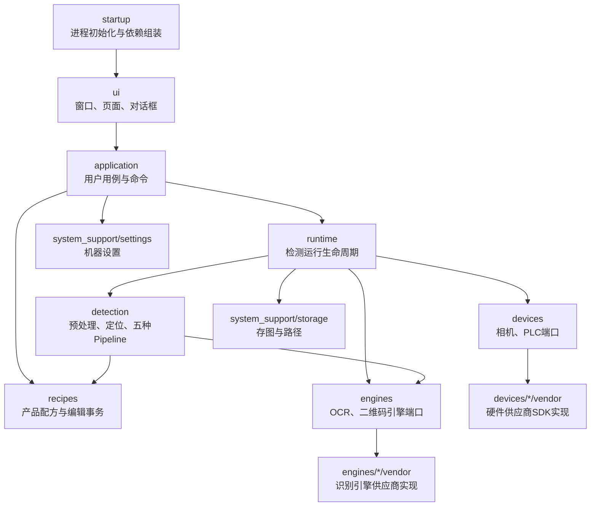

# OCRGangYin 新架构完全替换执行方案

版本：1.2
批准日期：2026-08-16
用途：交接给新的 Codex Agent 分阶段执行
状态：已批准，阶段 0 治理文档已完成；阶段 1 尚未开始

> 本文是 2026-08-16 起执行的终局架构依据。它覆盖《OCRGangYin 工业视觉框架升级计划》中“保留或延期多相机”“唯一未结论产品可猜测性补发 NG”以及“2026-08-15 固定四轮已达到终局架构”的旧结论。旧文档和执行记录中的历史验证证据仍然有效，但不能再作为继续保留旧架构的依据。

## 一、目标、基准与已确认决策

### 1.1 目标

目标不是继续给旧架构增加 Controller，也不是在旧路径旁边长期维护一套新路径，而是建立唯一的新架构，并彻底删除旧线程、旧主窗口业务、旧配置链和兼容桥。

阶段完成必须同时满足四件事：

1. 新职责已经进入目标模块并成为正式程序唯一活跃路径。
2. 同阶段删除被替代的旧文件、旧引用和工程项。
3. Agent 完成测试源码、工程清单、零引用和差异检查。
4. 本轮全部代码和删除工作结束后，由用户在 Qt Creator 集中验证一次，证明最终差异可以独立工作。

### 1.2 仓库基准

- 仓库：`D:\BaiduNetdiskDownload\ocr20260407\ocrgangyin`
- 分支：`codex/ocrgangyin-refactor`
- 阶段 0 核对 HEAD：`8595cb2 refactor: complete stage 4 architecture closure`
- 阶段 0 历史工具链：Qt 5.14、qmake、MSVC2017、C++11。当前本地 Qt Creator 已选用 Qt 5.15.2/MSVC2019 64-bit Kit；`AutoOCRproject.pro` 只声明 Qt 模块和 C++11，不锁定 Qt 补丁版本。
- 2026-08-16 阶段 0 实查：`git status --short --untracked-files=all` 无输出，工作区干净；交接基准提到的未跟踪文件 `app.zip` 当前未找到。Agent 不得创建、修改、移动、删除或提交 `app.zip`；若它之后重新出现，必须继续视为用户文件并排除在所有操作之外。
- 当前功能表历史基准：已验证 88 项、已延期 2 项；按本方案更新治理结论后为已验证 87 项、已确认删除 3 项、其余状态为 0。
- 现有“重构完成”只代表 2026-08-15 固定四轮计划及其门禁已完成，不代表达到本文定义的终局架构。

### 1.3 用户已确认的行为边界

- 删除全部多相机功能，包括占位窗口、无入口底层 API、类型、工程清单和 UI 入口。
- PLC 或系统故障采用简化策略，不再为唯一未结论产品猜测补发 NG。
- 正常 PLC 行为保持：OK 写 0；NG 写 49，约 100 ms 后写 0。
- 保持现有界面外观、按钮入口、中文提示语义和操作流程。
- 除多相机和 Fault 兜底策略外，其余用户可达功能全部保留。
- 不兼容旧模板、旧设置和旧目录，不提供运行时兼容或离线转换工具。
- 真实相机可用于回归；当前无真实 PLC。PLC 只做 Fake 合同验证，真实 PLC 与机械剔除的现场验收保持待验。
- 本方案实施时保持 Qt 5.14、qmake、MSVC2017、C++11；这是历史执行边界，当前构建以 1.2 节记录的本地 Kit 为准。
- 不调整五种算法的判定、阈值、模型和正常统计口径。

### 1.4 功能表终局要求

- `MC-001..003`：`已确认删除`。
- 其余 87 项：必须保持或恢复为 `已验证`。
- 不允许遗留 `待盘点 / 已基线 / 迁移中 / 已延期`。
- 真实 PLC 现场门禁不冒充普通功能 ID 的已验证证据；最终交付必须单独保留“真实 PLC 现场门禁待验”。

### 1.5 固定轮次与统一验证规则

- 阶段就是轮次：阶段 0～7 各固定为一轮，共 8 轮；阶段 0 已完成，剩余阶段 1～7 共 7 轮。
- 每轮开始时一次列全受影响功能 ID 和真实调用链，不把一个阶段拆成多个开发轮次。
- 每轮内允许 Agent 按内部顺序完成新实现、接入唯一正式路径、删除旧路径、补测试和静态检查，但中途不要求用户构建。
- Agent 必须在交付用户验证前完成本阶段计划内的旧文件删除和工程清单更新，不把删除留到下一轮。
- 用户只在每轮末执行一次集中验证，统一覆盖接入结果和删除结果。
- 集中验证失败后的诊断、代码修复和复验仍属于原轮次，不增加轮数，不提前进入下一阶段。
- 只有轮末集中验证通过，受影响功能才能从 `迁移中` 恢复为 `已验证`，并开始下一轮。
- 每轮门禁通过后，Agent 自动创建一个仅包含本阶段差异的本地 Git 提交，不再逐次请求提交授权；禁止自动推送、合并、变基或改写其他提交。
- 自动提交前必须执行 `git diff --check`、核对暂存文件清单并排除所有用户文件；提交完成后在回复中报告提交哈希和标题。
- 若发现会改变已确认范围、算法判定、正常 PLC 时序或删除额外用户功能的问题，暂停当前轮请求用户决策；这属于范围变更，不得由 Agent 擅自处理。

## 二、当前必须消除的架构问题

当前代码是“模块化外壳包住旧核心”，上一轮抽取没有改变以下终局问题：

- `widget.cpp` 仍有约 3437 非空行，`widget.h` 直接包含算法、OpenCV Tracking、设备、配置和运行类型。
- `Widget` 仍持有 PLC 脉冲状态、Fault 恢复、模板状态、图像缓存和大量运行字段。
- `TemplateEditorController` 约 5333 行，并通过 `friend` 和 `Ui::Widget` 直接操作主窗口。
- `InspectionStartController`、`InspectionStopController` 通过 `friend` 直接读取控件和 Widget 私有状态。
- `MyThread` 与 `CameraThread` 分别实现软、硬触发采集，但复制了旋转、通道、定位、Profile 和检测分发逻辑。
- `InspectionAcquisitionController` 仍直接构造并管理两个旧线程。
- 线程停止超时后会放弃对象和图像缓冲区所有权，故意泄漏以避免 UAF。
- `ICameraDevice` 暴露 `latestImage`、`readBuffer`、`setNonBlocking` 等旧实现细节。
- `HikvisionCameraDevice` 仍通过根目录 `CMvCamera` 工作。
- `TemplateMatch` 仍被构造并接收旧 `ssim/jiancestring` 信号，但正式图像入口已经没有实际调用价值。
- `Zhuizong` 被多处构造，但其方法没有正式业务调用。
- `AppSettingsManager` 同时承担机器设置、模板私有设置和路径规则。
- `recipes/template_runtime_profile.h` 反向依赖 `appsettingsmanager` 和 detection 实现。
- `InspectionResultCoordinator` 位于 UI 层，却拥有检测 Worker、存图服务和结果副作用。
- `.pro` 中存在重复库项、重复部署项和根目录旧文件清单。

这些问题必须通过职责迁移、唯一路径接入和旧实现删除解决，不能再通过新增一层转发 Controller 掩盖。

## 三、终局架构与依赖规则



### 3.1 强制依赖规则

- `ui` 只能依赖 `application` 的命令、查询和只读 DTO。
- `ui` 不得持有生产线程、设备、算法、PLC 时序和存图服务。
- `application` 组织用户用例，不执行图像算法和 SDK 调用。
- `runtime` 不依赖 `Widget`、`MainWindow`、`Ui::*` 或 `QMessageBox`。
- `detection` 不依赖 UI、磁盘、PLC 或相机 SDK。
- `recipes` 不依赖 detection 实现、UI 或全局设置管理器。
- 硬件供应商类型只能出现在 `devices/*/vendor`，OCR和二维码供应商类型只能出现在 `engines/*/vendor`。
- `startup` 是整个应用的纯组合根，负责进程初始化并组装完整对象图，包括 vendor 设备和引擎实现、Store、Runtime、应用服务、页面和 `MainWindow`。
- `startup` 是唯一允许构造具体设备和引擎实现的位置，但不得包含业务规则、算法、设备时序、结果判定或 UI 用例逻辑。
- 每次运行只有一个 `InspectionRunContext`、一条检测结果链和一个 PLC 输出入口。
- 禁止通过 `friend`、主窗口裸指针或 `Ui::Widget *` 穿透边界。

### 3.2 目标目录

```text
app/
├─ startup/
├─ application/
│  ├─ inspection_application_service.*
│  ├─ template_application_service.*
│  ├─ settings_application_service.*
│  └─ application_types.h
├─ ui/
│  ├─ main_window.*
│  ├─ pages/
│  │  ├─ inspection_page.*
│  │  ├─ template_editor_page.*
│  │  └─ machine_settings_page.*
│  ├─ dialogs/
│  ├─ presenters/
│  └─ widgets/
├─ runtime/
│  ├─ inspection_runtime.*
│  ├─ camera_session.*
│  ├─ capture_worker.*
│  ├─ detection_worker.*
│  ├─ result_service.*
│  ├─ frame_queue.*
│  └─ runtime_types.h
├─ detection/
│  ├─ detection_pipeline.h
│  ├─ pipeline_registry.*
│  ├─ positioning/
│  ├─ common/
│  ├─ stamp/
│  ├─ word/
│  ├─ ocr/
│  ├─ tissue/
│  └─ barcode_word/
├─ recipes/
│  ├─ product_recipe.*
│  ├─ prepared_recipe.*
│  ├─ recipe_store.*
│  ├─ recipe_editor_session.*
│  └─ recipe_asset_service.*
├─ devices/
│  ├─ camera/
│  └─ plc/
├─ engines/
│  ├─ ocr/
│  └─ barcode/
└─ system_support/
   ├─ settings/
   ├─ storage/
   ├─ logging/
   ├─ license/
   └─ crash/
```

## 四、核心类型与公开接口

### 4.1 数据模型

终局只保留以下核心模型作为跨层语言：

- `MachineSettings`
  - 相机曝光、增益、触发模式
  - 旋转、颜色通道、检测间隔
  - PLC 地址和工艺参数
  - 存图策略和界面布局
- `ProductRecipe`
  - 产品 UUID、名称、检测模式
  - 类型化检测参数
  - ROI、Profile 和相对资源路径
- `PreparedRecipe`
  - 从 `ProductRecipe` 加载出的只读运行资产
  - 定位模板、字符模板、校准数据、准备后的匹配数据
- `InspectionRunContext`
  - 运行 UUID
  - `MachineSettings` 快照
  - `PreparedRecipe` 快照
  - 启动时间和保存策略
- `FrameData`
  - `ProductKey`
  - 相机帧号、采集时间、只读图像
- `DetectionResult`
  - `AlgorithmVerdict`
  - `DetectionStatus`
  - 识别文本、命中 Profile、Overlay、耗时
- `InspectionPresentation`
  - 同一产品的结果图、文字、模板名、统计、耗时和状态
- `ApplicationError`
  - 错误码、用户提示、诊断信息

运行中的算法只读取 `InspectionRunContext`，不得重新读取控件、设置文件或模板目录。

### 4.2 应用层

```cpp
class InspectionApplicationService : public QObject
{
    Q_OBJECT
public:
    StartInspectionResult start(const QString &recipeId);
    StopInspectionResult stop();
    OperationResult openCamera();
    OperationResult closeCamera();
    OperationResult acknowledgeFault();

    RuntimeSnapshot runtimeSnapshot() const;

signals:
    void runtimeSnapshotChanged(RuntimeSnapshot snapshot);
    void inspectionPresented(InspectionPresentation presentation);
    void applicationErrorRaised(ApplicationError error);
};
```

```cpp
class SettingsApplicationService
{
public:
    MachineSettings current() const;
    MachineSettingsDraft draft() const;
    void updateDraft(const MachineSettingsDraft &draft);
    OperationResult applyDraft();
    void discardDraft();
    OperationResult restoreDefaults();
    OperationResult clearSettings();
    bool hasUnappliedChanges() const;
};
```

```cpp
class TemplateApplicationService
{
public:
    TemplateDraft beginNew(DetectionMode mode);
    TemplateDraft beginEdit(const QString &recipeId);
    RecipeValidationResult validate(const TemplateDraft &draft) const;
    RecipeSaveResult save(const TemplateDraft &draft);
    void cancel();
};
```

应用服务返回结构化结果，不弹对话框。所有确认框和中文提示留在 UI。

### 4.3 相机端口

删除旧 `ICameraDevice` 中的 `latestImage/readBuffer/setNonBlocking/deferSwitchToBlockingAfterNextFrame`。新接口固定为：

```cpp
class ICameraDevice
{
public:
    virtual ~ICameraDevice() {}

    virtual CameraResult enumerate(int *deviceCount) = 0;
    virtual CameraResult openFirst() = 0;
    virtual CameraResult applySettings(const CameraSettings &settings) = 0;
    virtual CameraResult setTriggerMode(CameraTriggerMode mode) = 0;
    virtual CameraResult startGrabbing() = 0;
    virtual CameraResult triggerSoftware() = 0;
    virtual CameraFrameResult waitNextFrame(int timeoutMs) = 0;
    virtual void interruptWait() = 0;
    virtual CameraResult stopGrabbing() = 0;
    virtual CameraResult close() = 0;
};
```

`waitNextFrame` 只返回以下状态：

- `FrameReady`
- `Timeout`
- `Interrupted`
- `DeviceError`

设备适配器内部负责 SDK 回调、条件变量、像素转换和图像所有权。

### 4.4 采集线程

使用一个 `CaptureWorker` 替代 `MyThread` 和 `CameraThread`：

- 使用一个 `std::thread`，与现有 `DetectionWorker` 生命周期模型一致。
- `SoftwareTrigger`
  - 等待上一产品进入可受理状态。
  - 执行一次软触发。
  - 等待帧号增加的新帧。
  - 不附加 `cameraDelay` 或其他固定软件等待；节拍由相机速度和正式链反压决定。
- `HardwareTrigger`
  - 等待相机下一帧。
  - 启动时把界面硬触发延时从ms换算为µs写入海康 `TriggerDelay`。
  - 使用容量 1 的正式帧队列。
  - 无队列空间时进入 Fault，不覆盖已受理帧。
- `Preview`
  - 只保留最新帧。
  - 不创建 `ProductKey`，不进入检测、统计、存图或 PLC 链。
- 停止
  - 设置停止标志。
  - 调用 `ICameraDevice::interruptWait()`。
  - `join()` 后才能销毁对象。
  - 禁止 detach、泄漏、`QThread::terminate()` 和超时后放弃所有权。

旋转、颜色通道、定位和 Profile 选择从采集线程迁入检测预处理，不再复制两套逻辑。

### 4.5 检测和结果

```cpp
class IDetectionPipeline
{
public:
    virtual ~IDetectionPipeline() {}
    virtual DetectionResult execute(
        const DetectionRequest &request) = 0;
};
```

`PipelineRegistry` 使用稳定的 `DetectionMode` 注册五种 Pipeline，不再依赖 UI 下拉框整数索引。

统一链路：

```text
CaptureWorker
→ FrameQueue
→ FramePreprocessor
→ Pose/Profile定位
→ DetectionPipeline
→ DetectionResult
→ ResultService
→ 统计
→ PLC请求
→ 存图任务
→ InspectionPresentation
→ UI
```

`ResultService` 是唯一结果入口：

- 同一 `ProductKey` 只接受一次最终结果。
- 正常 OK/NG 只更新一次统计。
- 正常 PLC 请求只发生一次。
- 存图只提交一个产品任务。
- UI 一次应用完整 `InspectionPresentation`。
- 系统故障不能改写为产品 NG。

## 五、简化后的 Fault 与错误处理

发生相机断连、PLC 写失败、硬触发队列满或检测基础设施失败时：

1. 记录首个故障原因。
2. 停止受理新正式产品。
3. 取消采集和检测队列的阻塞等待。
4. 已经产生的算法结果保持原结论，不重复输出。
5. 已受理但没有最终算法结果的产品记为 `Unconfirmed`。
6. 不补发猜测性 NG，不执行“唯一未结论产品兜底 49”。
7. UI 显示视觉检测已暂停、输送线状态未知。
8. 操作员确认且运行线程已经退出后，恢复到 Idle。
9. PLC 或设备仍不可用时，下一次启动由正常启动预检拒绝。

保留的必要失败处理：

- 相机打开、采集和断连
- PLC 连接和写入
- OCR/二维码引擎加载
- 配方非法或资源缺失
- 设置和配方保存失败
- 磁盘写入失败
- 有界队列反压
- 用户取消和协作停止

删除的过度防御：

- 新旧配置双读取
- 自动创建缺失运行会话
- 多层 fallback
- 捕获全部异常后继续检测
- 超时后泄漏线程或缓冲区
- 必选依赖在每个函数重复判空
- 同一参数多个默认值
- Start/Stop 事务、Transition 和 Controller 多层包装同一线性流程
- 业务层通过 Widget 私有字段兜底
- 算法失败后偷偷换另一算法判定

必选依赖必须通过构造函数提供。无法构造完整有效对象时，启动直接失败。

## 六、分阶段实施

每阶段固定为一轮，只做一个可独立验证的职责集合。新路径实现、正式接入、旧路径删除、测试与工程清单、静态检查必须在本轮内全部完成，然后交给用户在轮末统一验证一次；不允许把删除推迟到“以后”。

允许新旧实现同时存在于未完成的工作差异中，但必须遵守：

- 不设置运行时开关。
- 不允许正式程序回退到旧路径。
- 阶段完成时旧路径必须清零。
- 中途不要求用户分别验证接入版和删除版；用户只验证本轮最终差异。
- 验证失败后的修复和复验继续计入本轮。
- 上一阶段未完成，不进入下一阶段。

### 阶段 0：更新治理文档

工作：

- 将本方案写入正式 Markdown 文件。
- 在主升级计划中记录本方案是新的终局替换阶段。
- 更新功能对照表：
  - `MC-001..003` 标为用户确认删除。
  - 记录 Fault 不再发送猜测性兜底 NG。
  - 其余 87 项继续要求保持。
- 在执行记录中新建“新架构完全替换”章节。
- 建立旧类型删除清单和每阶段功能 ID 映射。

完成标准：

- 文档之间没有“多相机继续延期”和“多相机删除”两种同时有效的结论。
- 没有代码修改。
- `app.zip` 若存在，保持未跟踪且未触碰；当前实查不存在，不得由 Agent 创建。

### 阶段 1：设置与配方成为唯一数据源

本轮第一项工作是冻结正式数据 Schema。Agent 必须先从当前代码、功能表和五种模式真实运行参数反向盘点，新增 `docs/development/OCRGangYin新架构数据Schema.md`；Schema 完整并通过静态自检后，才能开始修改生产代码。该盘点、Schema 冻结、代码实现、旧格式删除和轮末验证仍属于阶段 1 同一轮，不增加中间用户门禁。

Schema 文档必须逐字段列出：

- JSON 路径和字段名
- 对应 C++ 类型、枚举值和单位
- 必填/可选规则
- 合法范围和交叉字段约束
- 唯一默认值及其业务依据
- 机器设置、产品、Profile 或纯 UI 布局的归属
- 当前 UI 来源、旧持久化来源和运行消费者
- 保存格式、资源相对路径和缺失/损坏错误码
- 是否进入 `MachineSettings`、`ProductRecipe`、`PreparedRecipe` 或不再保留

Schema 至少完整覆盖：

- `MachineSettings` 根对象、`schemaVersion` 和新应用数据根目录规则
- 相机、触发、旋转、通道、检测间隔、PLC 工艺、存图和纯 UI 布局字段
- 五种 `DetectionMode` 的类型化 `ProductRecipe` 参数
- 单 Profile 与多 Profile 的 ROI、目标文本、阈值、二维码和字符模板字段
- 定位模板、字符模板、`calibrate_config.yaml` 等资源清单及相对路径
- `PreparedRecipe` 的准备结果和运行时必需资源
- 新建默认、加载校验、损坏拒绝、事务保存和错误返回

禁止在多个类或 UI 中保留第二套默认值。真实代码与既有文档冲突且无法从已确认行为判断时，必须在阶段 1 内暂停并询问用户，不能自行猜测。

建立：

- `MachineSettings`
- `MachineSettingsStore`
- `ProductRecipe`
- `PreparedRecipe`
- `RecipeStore`
- `RecipeEditorSession`

迁移：

- 机器设置只进入 `MachineSettingsStore`。
- 模板私有参数全部进入 `ProductRecipe/Profile`。
- 纸巾粗糙度进入纸巾配方。
- 相机曝光和增益继续属于机器设置。
- 运行时只使用配方和设置快照。
- 当前模板编辑 UI 暂时调用新 Store，但不得再写旧 INI。

同阶段删除：

- `AppSettingsManager`
- `GlobalSettings`
- `TemplatePrivateSettings`
- 旧模板私有 INI 读写
- 旧设置路径兼容
- `recipes` 对 detection 和旧设置管理器的反向依赖
- 重复默认值

最低影响功能：

- `SET-001..013`
- `TPL-006..016`
- 五模式启动资源预检

门禁：

- 新设置首次启动、保存、重启恢复、恢复默认、清空。
- 新配方创建、保存、加载、编辑和损坏拒绝。
- 配方整目录事务保存失败时原配方仍可读取。
- 旧设置和旧模板必须明确不再识别。
- 用户在 Qt Creator 执行 Run qmake、Rebuild 和相关测试。

### 阶段 2：建立应用层并切断启动/停止对 Widget 的访问

建立：

- `InspectionApplicationService`
- `SettingsApplicationService`
- 应用命令和只读状态 DTO

迁移：

- 启动预检、运行状态判断、配方准备和运行命令进入应用层。
- UI 只负责脏参数确认、提示展示和命令调用。
- 停止流程进入 `InspectionApplicationService::stop()`。
- 运行状态只保留一份；删除 `isCollecting`、`m_operationState`、Runtime 状态并存的多真源模式。

同阶段删除：

- `InspectionStartController`
- `InspectionStopController`
- 两个对应的 `friend`
- Controller 中对 `Widget`、`Ui::Widget` 和控件的直接读取
- `QCoreApplication::processEvents` 停止兜底
- 重复的启动/停止状态字段

最低影响功能：

- `RUN-001..003`
- `UI-002`
- `SET-004..005`
- `CAM-001..002`
- `PLC-001..004`

门禁：

- 相机未开、配方非法、参数未应用、PLC 触发已开但未连接时提示保持。
- 五种模式可启动、停止、再次启动。
- 快速重复点击不会产生第二条运行链。
- Start/Stop 生产源码不再包含 `widget.h`。

### 阶段 3：替换相机和采集核心，并删除多相机

建立：

- 新 `ICameraDevice`
- 直接使用 MVS SDK 的 `HikvisionCameraDevice`
- `CameraSession`
- 单一 `CaptureWorker`
- 共享 `FramePreprocessor`
- `detection/positioning/TrackingPoseMatcher`

迁移：

- 软触发、硬触发和模板预览使用同一相机 Session。
- 定位、Profile 选择、旋转和通道处理进入检测预处理。
- 相机 SDK 回调只负责形成独立 `CameraFrame`。
- `CaptureWorker` 不访问 UI、模板目录或具体 Pipeline。

同阶段删除：

- `MyThread`
- `CameraThread`
- `InspectionAcquisitionController`
- `InspectionWorkerConfigurator`
- 旧相机启动/恢复/停止 Transition 类
- `CMvCamera`
- `Zhuizong`
- `ReadBuffer` 等无生产入口 API
- `MultiCameraWidget`
- `MultiCameraController`
- `MultiCameraUnit`
- `MultiCameraSyncManager`
- `IMultiCameraProvider`
- 所有多相机 UI、类型和 `.pro` 项

最低影响功能：

- `CAM-001..006`
- `RUN-001..006`
- `TPL-001..002`
- `SET-006..010`
- `MC-001..003`

门禁：

- 真实相机打开、关闭、曝光、增益。
- 模板实时预览、冻结、退出和再次进入。
- 五模式软触发。
- 硬触发使用 Fake 和现有相机可执行路径验证。
- 软触发在硬触发延时为0和非0时节拍均不受该值影响；硬触发分别验证 `TriggerDelay=0` 和非0。
- 停止、重启和退出后零线程残留。
- 全仓没有 `MyThread/CameraThread/CMvCamera/Zhuizong/MultiCamera` 生产引用。

### 阶段 4：统一 Runtime、检测和结果链

建立：

- `InspectionRuntime`
- `PipelineRegistry`
- `ResultService`
- `RuntimeSnapshot`
- `InspectionPresentation`

保留并复用：

- 五种现有 Pipeline 的算法实现
- `FrameQueue`
- `DetectionWorker`
- 容量 32、两个写入线程的 `ImageSaveService`
- 容量 1 的完整结果呈现邮箱
- 正常 PLC 控制器

迁移：

- 模式选择从整数索引改为 `DetectionMode`。
- 一次启动创建一个不可变 `InspectionRunContext`。
- 定位和 Pipeline 在同一检测 Worker 中串行执行。
- 统计、存图、PLC 和呈现从统一结果入口产生。
- Fault 使用已确认的简化策略。

同阶段删除或合并：

- `InspectionRuntimeController`
- `InspectionRuntimeStartTransaction`
- `InspectionRuntimeStopTransaction`
- `InspectionFaultState`
- `InspectionProductReconciler`
- `DetectionSession` 的自动补建逻辑
- `InspectionResultCoordinator`
- `DetectionCompletionController`
- `InspectionRuntimeUiCoordinator` 中的业务状态
- 多个重复结果收尾函数
- UI 层对存图和 PLC 的回调编排

最低影响功能：

- `DET-001..008`
- `RES-001..005`
- `SAVE-001..005`
- `PLC-005..007`
- `UI-003..005`

门禁：

- 五模式固定样本的 OK/NG、识别文本和 Overlay 与基线一致。
- 同一 `ProductKey` 重复完成只接受一次。
- 统计只更新一次。
- 正常 PLC Fake：OK 一次写 0；NG 一次 49→约 100 ms→0。
- PLC 写失败进入 Fault，但不覆盖算法结果、不猜测补发 NG。
- 存图队列满时反压且不漏任务。
- UI 图、文字、判定、模板名、统计和耗时来自同一产品。

### 阶段 5：重建模板编辑器

建立：

- `TemplateEditorPage`
- `TemplateApplicationService`
- `RecipeEditorSession`
- `RecipeAssetService`
- `TemplateGeometryService`
- 纯 UI 的 `CharacterTemplateEditorDialog`

职责：

- 页面负责鼠标、绘图、引导和控件。
- `TemplateDraft` 保存编辑状态。
- `TemplateGeometryService` 负责显示坐标、原图坐标、ROI 和裁剪。
- `RecipeAssetService` 负责字符资产和资源组织。
- `TemplateApplicationService` 负责完整校验和事务保存。
- 字符裁切对话框只返回字符框、名称和图像，不直接写文件或设置。

同阶段删除：

- `TemplateEditorController`
- `CharacterTemplateCropDialog` 的旧直接持久化实现
- `TemplateEditorController` 对 `Widget` 和 `Ui::Widget` 的访问
- 最后一个业务 `friend`
- 旧模板目录选择、加载、重发和保存路径
- 模板编辑中的重复二维码/日期 ROI 几何
- 模板编辑对 `TemplateMatch::prepareDigitTemplates` 的调用

最低影响功能：

- `TPL-001..016`
- `UI-001`
- `UI-006`
- `SET-003..004`

门禁：

- 钢印、字库、深度 OCR、二维码+三期模板制作。
- 定位矩形、二维码即时验证、日期多边形。
- 字符切割和命名。
- 单 Profile、多 Profile、单个和批量编辑。
- 发布、编辑、同 UUID 重发和跨模式恢复。
- 纸巾无模板配方。
- 保存任一步骤失败时正式配方不改变。
- 全仓业务代码无 `friend class TemplateEditorController` 和 `Ui::Widget *` 穿透。

### 阶段 6：替换 Widget 和整理根目录

建立：

- `ui/main_window.*`
- `ui/pages/inspection_page.*`
- `ui/pages/machine_settings_page.*`
- `ui/pages/template_editor_page.*`
- `ui/widgets/image_label.*`

保持当前视觉布局，但把 `widget.ui` 拆成页面组件。

`MainWindow` 只负责：

- 组装页面
- 连接页面信号到应用服务
- 展示结构化结果和错误
- 保存纯界面布局状态

同阶段删除：

- `widget.cpp`
- `widget.h`
- `widget.ui`
- 旧 `Widget` 信号：`imgshibie/jiancestring/ssim/pipei/captureFrame`
- `TemplateMatch`
- 所有 Widget 算法、模板、设备、PLC、线程和存图字段
- 已无调用的图像浏览、跟踪和裸指针缓存
- `using namespace cv` 等公共头污染

迁移根目录算法：

- `TrackingPoseMatcher` → `detection/positioning`
- `TissueRollDetector` → `detection/tissue`
- `OverlapDetector` → `detection/stamp`
- `TrackingTypes.h` 拆为 runtime、detection、presentation 类型
- `DetectionModes` 改为稳定 `DetectionMode`
- Paddle OCR 内部代码移到 OCR vendor 实现目录
- Barcode SDK 类型移到 barcode vendor 目录
- Snap7 C++ 包装源码移到 PLC vendor 目录，继续链接现有 `snap7.lib`

门禁：

- `startup` 只负责进程初始化和完整对象图组装：构造 vendor 设备、Store、Runtime、应用服务、页面与 `MainWindow`，然后连接顶层依赖；其中不得包含任何业务逻辑。
- `main_window.cpp` 不超过约 600 非空行。
- 任一自研、非生成、非纯算法 `.cpp` 超过 1500 非空行时，必须按职责拆分。
- 业务代码无 `Widget`、`Ui::Widget`、`TemplateMatch` 和根目录旧类引用。
- 界面外观和入口与当前版本保持。

### 阶段 7：工程清单和最终验收

清理：

- `.pro` 只保留真实源文件。
- 删除重复 `RC_ICONS`、部署和 `target.path` 段。
- 删除重复 OpenCV tracking 链接项。
- 修正缺少续行符的 OpenCV 库列表。
- Snap7 保留“C++ 包装源码 + 外部 DLL/import lib”这一套明确组合，不重复维护第二份实现。
- 新增、删除和移动文件后统一更新 qmake 清单。
- 删除注释掉的大段旧实现和无调用公共 API。

最终静态门禁：

```text
rg "friend class" app
rg "#include \"widget.h\"" app
rg "MyThread|CameraThread|CMvCamera|TemplateMatch|Zhuizong" app
rg "AppSettingsManager|TemplatePrivateSettings|GlobalSettings" app
rg "MultiCamera|IMultiCameraProvider" app
rg "QThread::terminate|\\.terminate\\(" app
rg "setParent\\(nullptr\\).*worker|release\\(\\).*buffer" app
```

除第三方库自身合法 `friend` 外，目标旧符号必须为零。

## 七、固定轮次与功能 ID 映射

阶段号就是轮次号。阶段 0 已完成；剩余执行严格固定为第 1～7 轮，不因编译修复、运行修复或复验增加轮次。

| 阶段 | 最低功能 ID | 关键用户门禁 |
|---|---|---|
| 阶段 0 | `MC-001..003`；Fault 决策影响 `UI-002、UI-005、RUN-001..004、PLC-005..007、RES-001` | 文档结论一致；其余 87 项基线不降级 |
| 阶段 1 | `SET-001..013、TPL-006..016`，五模式启动资源预检 | 新设置/配方唯一格式、事务保存、旧格式拒绝 |
| 阶段 2 | `RUN-001..003、UI-002、SET-004..005、CAM-001..002、PLC-001..004` | 五模式启停重启、重复启动拒绝、提示保持 |
| 阶段 3 | `CAM-001..006、RUN-001..006、TPL-001..002、SET-006..010、MC-001..003` | 真实相机、预览、软硬触发、停止 join、多相机删除 |
| 阶段 4 | `DET-001..008、RES-001..005、SAVE-001..005、PLC-005..007、UI-003..005` | 五模式一致、唯一结果、PLC Fake、Fault 简化、存图反压 |
| 阶段 5 | `TPL-001..016、UI-001、UI-006、SET-003..004` | 完整模板工作流和事务保存 |
| 阶段 6 | 全部 UI/启动/运行可达功能 | Widget 清零、页面化、外观与入口保持 |
| 阶段 7 | 全部 90 项及真实 PLC 现场待验记录 | 工程清单、全量自动/人工回归、旧符号零引用 |

每轮开始前必须重新追踪真实调用链。上表是最低范围，不是跳过实际受影响功能的许可。每轮末由用户对本轮最终代码集中验证一次。

## 八、旧类型删除清单

| 删除阶段 | 旧类型、文件或机制 | 删除前置条件 |
|---|---|---|
| 1 | `AppSettingsManager`、`GlobalSettings`、`TemplatePrivateSettings`、旧 INI 和旧路径兼容 | 新 Store 成为唯一读写路径；设置/配方门禁通过 |
| 2 | `InspectionStartController`、`InspectionStopController`、对应 `friend`、重复运行状态 | 应用服务成为唯一启停入口 |
| 3 | `MyThread`、`CameraThread`、`InspectionAcquisitionController`、`InspectionWorkerConfigurator`、旧相机 Transition、`CMvCamera`、`Zhuizong`、旧 ReadBuffer API、全部多相机类型/UI | 新相机端口、Session、CaptureWorker 接入并完成真实相机门禁 |
| 4 | `InspectionRuntimeController`、Start/Stop Transaction、`InspectionFaultState`、`InspectionProductReconciler`、`InspectionResultCoordinator`、`DetectionCompletionController`、UI 业务协调和重复收尾函数 | 单一 Runtime 和 ResultService 通过一致性/Fake PLC/Fault 门禁 |
| 5 | `TemplateEditorController`、旧字符裁切持久化、模板编辑 `friend`、旧目录选择/保存/重发路径 | 新模板页面和应用服务完成全部模板门禁 |
| 6 | `Widget` 三件套、`TemplateMatch`、旧 Widget 信号、根目录旧算法/类型和公共头污染 | MainWindow/页面成为唯一 UI；外观与入口回归通过 |
| 7 | 重复 `.pro` 项、注释旧实现、无调用公共 API、重复第三方包装 | 全仓零引用、qmake 清单和最终回归通过 |

删除规则：Git 历史就是备份；源码内不保留注释旧实现、兼容开关、双路径或“以后再删”的桥。

## 九、验证与交付门禁

### 9.1 Agent 负责

- 阅读真实调用链并列出本阶段功能 ID。
- 修改源码和测试源码。
- 检查 include、声明/定义、信号槽和工程清单。
- 执行 `rg` 零引用检查。
- 执行 `git diff --check`。
- 更新功能对照表和执行记录。
- 在交付验证前完成本轮全部计划内旧路径删除，不提供“仅接入、尚未删除”的中间验证版本。
- 不触碰 `app.zip`。
- 不自行运行 qmake、编译、测试或主程序。
- 每轮门禁通过后自动暂存本阶段精确文件、复核暂存差异并创建一个本地提交；不自动推送。

### 9.2 用户在 Qt Creator 负责

每轮代码、删除、测试源码和工程清单全部完成后，用户集中执行一次：

1. Run qmake。
2. Rebuild。
3. 运行对应测试工程。
4. 运行主程序人工回归。
5. 将完整错误或通过结果反馈给 Agent。

这一次集中验证同时覆盖：

- 新路径已经成为唯一活跃路径。
- 旧文件、旧引用和旧工程项删除后仍可完整构建运行。
- 本轮受影响功能从原入口保持预期行为。
- 新增自动测试和既有相关测试全部通过。

集中验证未通过时，阶段不得完成，也不得进入下一阶段；Agent 修复后仍按原轮次交回用户复验，不增加轮次。

集中验证通过后，Agent 更新功能表和执行记录，执行最终静态检查，并自动创建本阶段唯一的本地 Git 提交。阶段 0 为纯文档阶段，以静态门禁通过作为提交条件。

### 9.3 自动测试最低集合

- `MachineSettingsStore`
- `RecipeStore` 完整保存和失败不破坏旧数据
- 五种 Pipeline 的 OK/NG/失败
- ROI 和坐标几何
- 软触发新帧绑定
- 硬触发容量 1 队列
- 采集停止和 join
- 唯一结果、重复结果拒绝
- 正常 PLC Fake 写入顺序
- PLC 写失败进入 Fault 且不猜测 NG
- 存图容量 32、两个线程、满时等待
- UI 完整结果快照

### 9.4 人工回归

保留的 87 项功能必须逐项从原入口验证，重点包括：

- 启动保护、授权、单实例、日志和崩溃记录
- 相机打开、关闭、曝光、增益
- 五种模式切换和启动
- 软触发、硬触发、停止和重启
- 模板预览、冻结、绘图和保存
- 字符切割、多 Profile、批量编辑
- 新配方发布、选择和重发
- 设置保存、恢复默认和清空
- 图像、Overlay、文字、判定、统计和耗时同步
- 四种存图策略和原图/标注图组合
- JPEG 质量 92
- 正常关闭程序且无残留线程

真实相机完成实际回归。

真实 PLC 当前不可用，因此：

- Fake 测试通过只能证明地址、编码、0/49 顺序和 Fault 合同。
- 不得声明真实 PLC、机械剔除或现场恢复已经验证。
- 最终交付记录必须保留“真实 PLC 现场门禁待验”。
- 架构代码可以完成，但不能称为完整现场生产验收完成。

## 十、最终完成定义

只有同时满足以下条件，才能宣布“旧架构已经完全移除”：

- 多相机所有源码、UI、类型和工程项已经删除。
- `Widget`、三个旧 Controller、两个旧采集线程和旧相机包装已经删除。
- `TemplateEditorController` 不存在。
- `AppSettingsManager` 和旧模板/设置格式不存在。
- UI 不持有设备、线程、算法、PLC 和存图服务。
- Runtime 不依赖任何 UI 类型。
- Detection 不访问 UI、磁盘、PLC 和相机 SDK。
- 第三方 SDK 只出现在 vendor 实现。
- 同一产品只有一个结果、统计、存图和 PLC 出口。
- 停止路径不泄漏、不 detach、不强杀线程。
- 没有运行时兼容开关、新旧双路径和多层 fallback。
- 保留的 87 项功能全部通过用户 Qt Creator 门禁。
- `MC-001..003` 有用户确认删除记录。
- 功能表没有 `待盘点 / 已基线 / 迁移中 / 已延期`。
- 真实 PLC 现场项明确记录为待验，没有被 Fake 测试冒充完成。

满足上述架构条件时可以声明“新架构替换完成”；只有真实 PLC 现场门禁也通过后，才可以另行声明“完整现场生产验收完成”。
